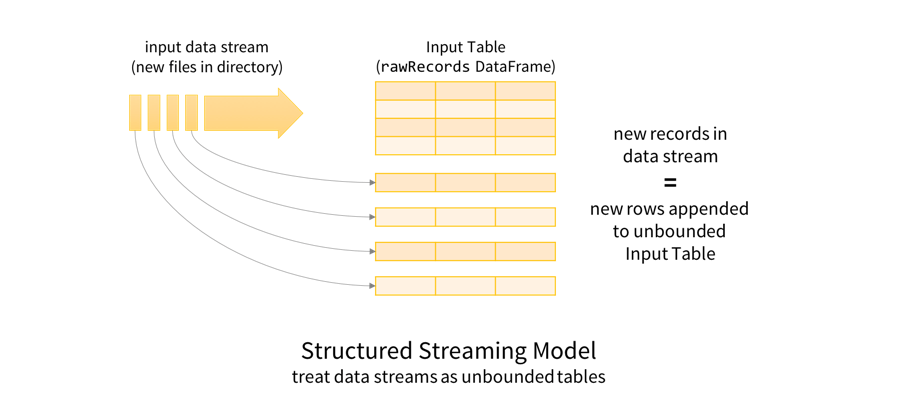
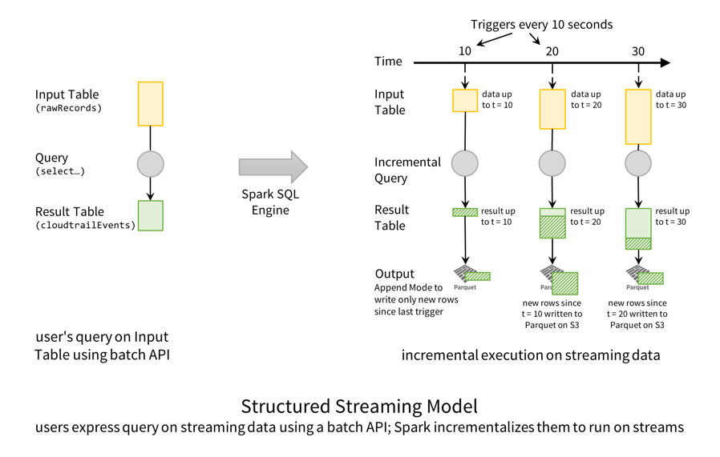
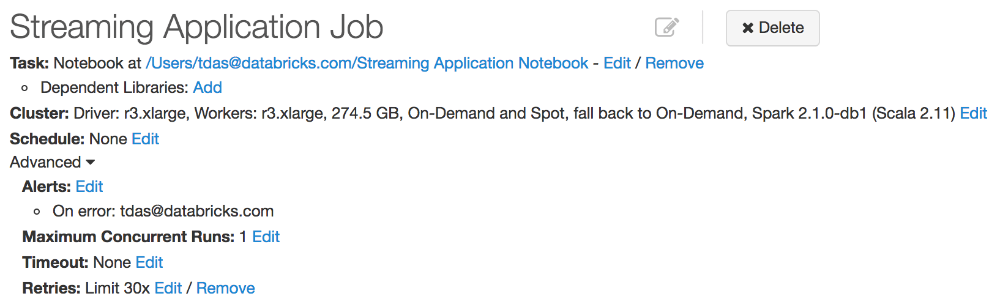

# Real-time Streaming ETL with Structured Streaming in Apache Spark 2.1

Part 1 of Scalable Data @ Databricks

by Tathagata Das, Michael Armbrust and Tyson Condie Posted in Engineering Blog January 19, 2017

我们正处于大数据时代，伴随着各类机构不断收集大量数据。然而，这种数据泛滥的价值取决于及时提取可操作见解的能力。因此，对连续应用程序的需求日益增长，这些应用程序可以从海量数据提取管道中获得实时可操作的见解。

尽管如此，建立生产级别的实时(continusous)应用是有挑战性的，开发者需要克服许多障碍，包括：

- **提供 end-to-end 的可靠性和正确性保障** - 长期运行的数据处理系统必须是弹性的 (resilent)，通过确保输出与批处理的结果一致来适应故障。此外，系统必须能够持续监控并自动缓解异常活动（例如上游组件故障，流量峰值等），以确保实时提供高可用性结果。

- **执行复杂的转换** - 数据通常以各类各样的格式 (CSV, JSON, Avro 等等) 到达，在消费使用之前必须经过重组 (reconstructure)，转换 (transform) 和扩充 (augment)。这种重组要求批处理系统中的所有传统工具都可用，但不造成这些工具需要的额外延迟。

- **处理延迟或无序的数据** - 在处理真实世界中的情况时，迟到或无序的数据是更为常见的事实。因此，必须在新信息到达时，实时（和准确）地修正聚合和其他复杂计算。

- **与其他系统集成** - 信息源自各种来源 (Kafka，HDFS，S3 等)，必须集成这些来源才能查看完整情况。

Apache Spark 中的结构化流建立在 Spark SQL 的强大基础之上，利用其强大的 API 提供无缝的查询界面，同时优化其执行引擎以实现低延迟，不断更新的答案。这篇博客文章开始了我们将探讨如何使用 Apache Spark 2.1 的新功能来克服上述挑战并构建我们自己的生产流水线的系列文章。

Structured Streaming in Apache Spark builds upon the strong foundation of Spark SQL, leveraging its powerful APIs to provide a seamless query interface, while simultaneously optimizing its execution engine to enable low-latency, continually updated answers. This blog post kicks off a series in which we will explore how we are using the new features of Apache Spark 2.1 to overcome the above challenges and build our own production pipelines.

在第一篇文章中，我们将重点介绍 ETL 管道，该管道将原始 AWS CloudTrail 审核日志转换为 JIT 数据仓库，以实现更快的即席查询。我们将展示采用现有批处理 ETL 作业并随后使用 Databricks 中的结构化流式处理将其作为实时流式管道进行产品化是多么容易。使用此管道，我们将包含 79 亿条记录的 380 万个 JSON 文件转换为 Parquet 表，这使我们能够在最新的 Parquet 表上进行即时查询，比原始 JSON 文件快 10 倍。

In this first post, we will focus on an ETL pipeline that converts raw AWS CloudTrail audit logs into a JIT data warehouse for faster ad-hoc queries. We will show how easy it is to take an existing batch ETL job and subsequently productize it as a real-time streaming pipeline using Structured Streaming in Databricks. Using this pipeline, we have converted 3.8 million JSON files containing 7.9 billion records into a Parquet table, which allows us to do ad-hoc queries on updated-to-the-minute Parquet table 10x faster than those on raw JSON files.

## The Need for Streaming ETL

提取，转换和加载 (ETL) 管道可将原始的非结构化数据准备为可轻松高效查询的表单。具体而言，他们需要能够执行以下操作：

Extract, Transform, and Load (ETL) pipelines prepare raw, unstructured data into a form that can be queried easily and efficiently. Specifically, they need to be able to do the following:

- **过滤，转换和清理数据** - 原始数据自然是杂乱的，需要清理以适应明确定义的结构化格式。例如，将时间戳字符串解析为日期/时间类型，以便更快地进行比较，过滤损坏的数据，嵌套/取消/展平复杂结构以更好地组织重要的列等。
- **转换为更高效的存储格式** - 文本，JSON 和 CSV 数据易于生成且易于阅读，但查询起来非常昂贵。将其转换为更高效的格式（如 Parquet，Avro 或 ORC）可以减小文件大小并提高处理速度。
- **重要列的分区数据** - 通过基于一列或多列的值对数据进行分区，通过仅读取总数据集的相关部分，可以更有效地回答常见查询。

- **Filter, transform, and clean up data** - Raw data is naturally messy and needs to be cleaned up to fit into a well-defined structured format. For example, parsing timestamp strings to date/time types for faster comparisons, filtering corrupted data, nesting/unnesting/flattening complex structures to better organize important columns, etc.
- **Convert to a more efficient storage format** - Text, JSON and CSV data are easy to generate and are human readable, but are very expensive to query. Converting it to more efficient formats like Parquet, Avro, or ORC can reduce file size and improve processing speed.
- **Partition data by important columns** - By partitioning the data based on the value of one or more columns, common queries can be answered more efficiently by reading only the relevant fraction of the total dataset.

传统上，ETL 作为定期批处理作业执行。例如，实时转储原始数据，然后每隔几个小时将其转换为结构化表单，以实现高效查询。我们最初以这种方式设置我们的系统，但这种技术带来了高延迟;在获得任何见解之前，我们不得不等待几个小时。对于许多用例，这种延迟是不可接受的。当帐户中发生可疑事件时，我们需要能够立即提问。等待几分钟到几个小时可能导致对事件做出反应的无理拖延。

Traditionally, ETL is performed as periodic batch jobs. For example, dump the raw data in real time, and then convert it to structured form every few hours to enable efficient queries. We had initially setup our system this way, but this technique incurred a high latency; we had to wait for few hours before getting any insights. For many use cases, this delay is unacceptable. When something suspicious is happening in an account, we need to be able to ask questions immediately. Waiting minutes to hours could result in an unreasonable delay in responding to an incident.

幸运的是，Structured Streaming 可以轻松地将这些定期批处理作业转换为实时数据管道。使用与批处理数据相同的 API 表示流式作业。此外，该引擎提供与周期性批处理作业相同的容错和数据一致性保证，同时提供更低的端到端延迟。

Fortunately, Structured Streaming makes it easy to convert these periodic batch jobs to a real-time data pipeline. Streaming jobs are expressed using the same APIs as batch data. Additionally, the engine provides the same fault-tolerance and data consistency guarantees as periodic batch jobs, while providing much lower end-to-end latency.

在本文的其余部分，我们将详细介绍如何将 AWS CloudTrail 审核日志转换为高效，分区的拼花数据仓库。AWS CloudTrail 允许我们通过将压缩的 JSON 日志文件提供给 S3 存储桶来跟踪在各种 AWS 账户中执行的所有操作。这些文件支持各种业务和关键任务智能，例如成本归因和安全监控。但是，即使具有 Apache Spark 的功能，它们的原始形式也很难查询。为了实现快速洞察，我们运行 Continuous Application，将原始 JSON 日志文件转换为优化的 Parquet 表。让我们深入研究如何编写此管道。如果你想看到完整的代码，这里是 Scala 和 Python 笔记本。将它们导入 Databricks 并自行运行。

In the rest of post, we dive into the details of how we transform AWS CloudTrail audit logs into an efficient, partitioned, parquet data warehouse. AWS CloudTrail allows us to track all actions performed in a variety of AWS accounts, by delivering gzipped JSON logs files to a S3 bucket. These files enable a variety of business and mission critical intelligence, such as cost attribution and security monitoring. However, in their original form, they are very costly to query, even with the capabilities of Apache Spark. To enable rapid insight, we run a Continuous Application that transforms the raw JSON logs files into an optimized Parquet table. Let’s dive in and look at how to write this pipeline. If you want to see the full code, here are the Scala and Python notebooks. Import them into Databricks and run them yourselves.

## 通过结构化流转换原始日志

我们首先根据 CloudTrail 文档定义 JSON 记录的模式。

We start by defining the schema of the JSON records based on CloudTrail documentation.

```scala
val cloudTrailSchema = new StructType()
  .add("Records", ArrayType(new StructType()
    .add("additionalEventData", StringType)
    .add("apiVersion", StringType)
    .add("awsRegion", StringType)
    // ...
```

有关完整架构，请参阅随附的记录。有了这个，我们可以定义一个流式 (streaming) 的 DataFrame，它表示来自正在写入 S3 存储桶的 CloudTrail 文件的数据流。

See the attached notebook for the full schema. With this, we can define a streaming DataFrame that represents the data stream from CloudTrail files that are being written in a S3 bucket.

```scala
val rawRecords = spark.readStream
  .schema(cloudTrailSchema)
  .json("s3n://mybucket/AWSLogs/*/CloudTrail/*/2017/*/*")
```

了解 rawRecords DataFrame 表示的内容的一个好方法是首先了解 Structured Streaming 编程模型。关键思想是将任何数据流视为无界表：添加到流中的新记录就像添加到表中的行一样。

A good way to understand what this rawRecords DataFrame represents is to first understand the Structured Streaming programming model. The key idea is to treat any data stream as an unbounded table: new records added to the stream are like rows being appended to the table.



这允许我们将批处理和流数据视为表。由于表和 DataFrames/Datasets 在语义上是同义的，因此可以对批处理和流数据应用相同的类似批处理的 DataFrame/Dataset 查询。在这种情况下，我们将转换原始 JSON 数据，以便使用 Spark SQL 的内置支持来操作复杂的嵌套模式更容易查询。这是转型的简略版本。

This allows us to treat both batch and streaming data as tables. Since tables and DataFrames/Datasets are semantically synonymous, the same batch-like DataFrame/Dataset queries can be applied to both batch and streaming data. In this case, we will transform the raw JSON data such that it’s easier to query using Spark SQL’s built-in support for manipulating complex nested schemas. Here is an abridged version of the transformation.

```scala
val cloudtrailEvents = rawRecords
  .select(explode($"records") as 'record)
  .select(
    unix_timestamp(
      $"record.eventTime",
      "yyyy-MM-dd'T'hh:mm:ss").cast("timestamp") as 'timestamp, $"record.*")
```

在这里，我们将从每个文件加载的记录数组分解（拆分）为单独的记录。我们还将每个记录中的字符串事件时间字符串解析为 Spark 的时间戳类型，并将嵌套列展平以便于查询。请注意，如果 cloudtrailEvents 是一组固定文件上的批处理 DataFrame，那么我们就会编写相同的查询，并且我们只将结果写为 parsed.write.parquet("/ cloudtrail")。相反，我们将启动一个 **StreamingQuery**，它持续运行以在新数据到达时对其进行转换。

Here, we explode (split) the array of records loaded from each file into separate records. We also parse the string event time string in each record to Spark’s timestamp type, and flatten out the nested columns for easier querying. Note that if cloudtrailEvents was a batch DataFrame on a fixed set of files, then we would have written the same query, and we would have written the results only once as parsed.write.parquet("/cloudtrail"). Instead, we will start a **StreamingQuery** that runs continuously to transform new data as it arrives.

```scala
val streamingETLQuery = cloudtrailEvents
  .withColumn("date", $"timestamp".cast("date") // derive the date
  .writeStream
  .trigger(ProcessingTime("10 seconds")) // check for files every 10s
  .format("parquet") // write as Parquet partitioned by date
  .partitionBy("date")
  .option("path", "/cloudtrail")
  .option("checkpointLocation", "/cloudtrail.checkpoint/")
  .start()
```

这里我们在开始之前为 StreamingQuery 指定以下配置。

Here we are specifying the following configurations for the StreamingQuery before starting it.

- 从时间戳列中导出日期
- 每 10 秒检查一次新文件（即触发间隔）
- 将解析后的 DataFrame 中的转换数据作为 Parquet 格式的表写入路径`/ cloudtrail`。
- 按日期对 Parquet 表进行分区，以便我们以后可以有效地查询数据的时间片;监控应用程序的关键要求。
- 在路径 `/ checkpoints / cloudtrail` 上保存检查点信息以获得容错（稍后在博客中解释）

- Derive the date from the timestamp column
- Check for new files every 10 seconds (i.e., trigger interval)
- Write the transformed data from parsed DataFrame as a Parquet-formatted table at the path `/cloudtrail`.
- Partition the Parquet table by date so that we can later efficiently query time slices of the data; a key requirement in monitoring applications.
- Save checkpoint information at the path `/checkpoints/cloudtrail` for fault-tolerance (explained later in the blog)

就结构化流模型而言，这是执行此查询的方式。

In terms of the Structured Streaming Model, this is how the execution of this query is performed.



从概念上讲，`rawRecords` DataFrame 是一个仅附加**输入表**，而`cloudtrailEvents` DataFrame 是转换后的**结果表**。换句话说，当新行被附加到输入 (`rawRecords`) 时，结果表 (`cloudtrailEvents`) 将具有新的变换行。在这种特殊情况下，每隔 10 秒，Spark SQL 引擎**就会触发**检查新文件。当它找到新数据（即输入表中的新行）时，它会转换数据以在结果表中生成新行，然后将其写为 Parquet 文件。

Conceptually, the `rawRecords` DataFrame is an append-only **Input Table**, and the `cloudtrailEvents` DataFrame is the transformed **Result Table**. In other words, when new rows are appended to the input (`rawRecords`), the result table (`cloudtrailEvents`) will have new transformed rows. In this particular case, every 10 seconds, Spark SQL engine **triggers** a check for new files. When it finds new data (i.e., new rows in the Input Table), it transforms the data to generate new rows in the Result Table, which then get written out as Parquet files.

此外，在运行此流式查询时，您可以使用 Spark SQL 同时查询 Parquet 表。流式查询以事务方式写入 Parquet 数据，使得并发交互式查询处理将始终看到最新数据的一致视图。这种强有力的保证称为前缀完整性，它使结构化流媒体管道与更大的连续应用程序很好地集成。

Furthermore, while this streaming query is running, you can use Spark SQL to simultaneously query the Parquet table. The streaming query writes the Parquet data transactionally such that concurrent interactive query processing will always see a consistent view of the latest data. This strong guarantee is known as prefix-integrity and it makes Structured Streaming pipelines integrate nicely with the larger Continuous Application.

## 解决生产环境的挑战

早些时候，我们强调了在生产中运行流式 ETL 管道必须解决的一些挑战。让我们看看在 Databricks 平台上运行的 Structured Streaming 是如何解决它们的。

Earlier, we highlighted a number of challenges that must be solved for running a streaming ETL pipeline in production. Let’s see how Structured Streaming running on the Databricks platform solves them.

### Recovering from Failures to get Exactly-once Fault-tolerance Guarantees

长时间运行的管道必须能够容忍机器故障。使用结构化流，实现容错就像为查询指定检查点位置一样简单。在前面的代码片段中，我们在以下行中执行了此操作。

Long running pipelines must be able to tolerate machine failures. With Structured Streaming, achieving fault-tolerance is as easy as specifying a checkpoint location for the query. In the earlier code snippet, we did so in the following line.

```scala
.option("checkpointLocation", "/cloudtrail.checkpoint/")
```

此检查点目录是每个查询，并且在查询处于活动状态时，Spark 会不断将已处理数据的元数据写入检查点目录。即使整个群集出现故障，也可以使用相同的检查点目录在新群集上重新启动查询，并始终进行恢复。更具体地说，在新集群上，Spark 使用元数据来启动新查询，其中失败的一个停止，从而确保端到端的一次性保证和数据一致性（请参阅我们之前博客的故障恢复部分）。

This checkpoint directory is per query, and while a query is active, Spark continuously writes metadata of the processed data to the checkpoint directory. Even if the entire cluster fails, the query can be restarted on a new cluster, using the same checkpoint directory, and consistently recover. More specifically, on the new cluster, Spark uses the metadata to start the new query where the failed one left off, thus ensuring end-to-end exactly-once guarantees and data consistency (see Fault Recovery section of our previous blog).

此外，只要输入源和输出架构保持不变，同样的机制允许您在重新启动之间升级查询。从 Spark 2.1 开始，我们使用 JSON 对检查点数据进行编码，以实现面向未来的兼容性。因此，即使在更新 Spark 版本后，您也可以重新启动查询。在所有情况下，您将获得相同的容错和一致性保证。

Furthermore, this same mechanism allows you to upgrade your query between restarts, as long as the input sources and output schema remain the same. Since Spark 2.1, we encode the checkpoint data in JSON for future-proof compatibility. So you can restart your query even after updating your Spark version. In all cases, you will get the same fault-tolerance and consistency guarantees.

请注意，**Databricks 可以很容易地设置自动恢复**，我们将在下一节中介绍。

Note that **Databricks makes it very easy to set up automatic recovery**, as we will show in the next section.

### Monitoring, Alerting and Upgrading

要使连续应用程序顺利运行，它必须对单个机器甚至整个群集故障都很稳健。在 Databricks 中，我们开发了与 Structured Streaming 的紧密集成，允许我们持续监控 StreamingQueries 的故障（并自动重启它们。您所要做的就是创建一个新的 Job，并配置 Job retry 策略。您还可以配置作业 发送电子邮件通知您失败。

For a Continuous Application to run smoothly, it must be robust to individual machine or even whole cluster failures. In Databricks, we have developed tight integration with Structured Streaming that allows us continuously monitor your StreamingQueries for failures (and automatically restart them. All you have to do is create a new Job, and configure the Job retry policy. You can also configure the job to send emails to notify you of failures.



通过更新代码和/或 Spark 版本然后重新启动作业，可以轻松地进行应用程序升级。有关更多详细信息，请参阅我们在生产中运行结构化流媒体的指南。

Application upgrades can be easily made by updating your code and/or Spark version and then restarting the Job. See our guide on running Structured Streaming in Production for more details.

机器故障不是我们需要处理以确保稳健处理的唯一情况。我们将在本系列的后面部分讨论如何监控流量峰值和上游故障。

Machine failures are not the only situations that we need to handle to ensure robust processing. We will discuss how to monitor for traffic spikes and upstream failures in more detail later in this series.

### Combining Live Data with Historical/Batch Data

许多应用程序需要将历史/批处理数据与实时数据相结合。例如，除了传入的审计日志之外，我们可能已经有大量积压的日志等待转换。理想情况下，我们希望尽快实现这两者，以交互方式查询最新数据，并且还可以访问历史数据以供将来分析。使用大多数现有系统设置此类管道通常很复杂，因为您必须设置多个进程：用于转换历史数据的批处理作业，用于转换实时数据的流式管道，以及可能需要另一个步骤来组合结果。

Many applications require historical/batch data to be combined with live data. For example, besides the incoming audit logs, we may already have a large backlog of logs waiting to be converted. Ideally, we would like to achieve both, interactively query the latest data as soon as possible, and also have access to historical data for future analysis. It is often complex to set up such a pipeline using most existing systems as you would have to set up multiples processes: a batch job to convert the historical data, a streaming pipeline to convert the live data, and maybe a another step to combine the results.

结构化流媒体消除了这一挑战。您可以配置上述查询，以便在处理新数据文件到达时对其进行优先级排序，同时使用空间群集容量来处理旧文件。首先，我们将文件源的选项`latestFirst`设置为 true，以便首先处理新文件。然后，我们设置 `maxFilesPerTrigger` 来限制每次处理的文件数。这会调整查询以更频繁地更新下游数据仓库，以便最新数据可用于尽快查询。我们可以一起定义 rawLogs DataFrame，如下所示：

Structured Streaming eliminates this challenge. You can configure the above query to prioritize the processing new data files as they arrive, while using the space cluster capacity to process the old files. First, we set the option `latestFirst` for the file source to true, so that new files are processed first. Then, we set the `maxFilesPerTrigger` to limit how many files to process every time. This tunes the query to update the downstream data warehouse more frequently, so that the latest data is made available for querying as soon as possible. Together, we can define the rawLogs DataFrame as follows:

```scala
val rawJson = spark.readStream
  .schema(cloudTrailSchema)
  .option("latestFirst", "true")
  .option("maxFilesPerTrigger", "20")
  .json("s3n://mybucket/AWSLogs/*/CloudTrail/*/2017/01/*")
```

通过这种方式，可以编写单个查询，轻松地将实时数据与历史数据相结合，同时确保低延迟，高效率和数据一致性。

In this way, we can write a single query that easily combines live data with historical data, while ensuring low-latency, efficiency and data consistency.

## Conclusion

如上所述，Apache Spark 中的 Structured Streaming 是编写流式 ETL 流水线的最佳框架，Databricks 可以轻松地在生产中大规模运行它们。我们分享了设置流式 ETL 生产流水线不同步骤的整体概述 - 提取，转换，加载和最终查询。我们还讨论并演示了 Structured Streaming 如何在生产中配置和解决高容量和低延迟流式流水线的挑战。

Structured Streaming in Apache Spark is the best framework for writing your streaming ETL pipelines, and Databricks makes it easy to run them in production at scale, as we demonstrated above. We shared a high level overview of the steps—extracting, transforming, loading and finally querying—to set up your streaming ETL production pipeline. We also discussed and demonstrated how Structured Streaming overcomes the challenges in solving and setting up high-volume and low-latency streaming pipelines in production.
