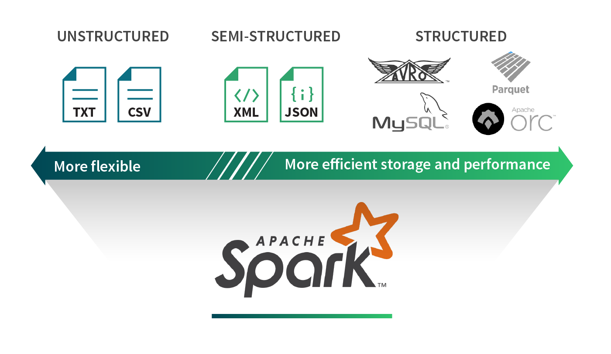
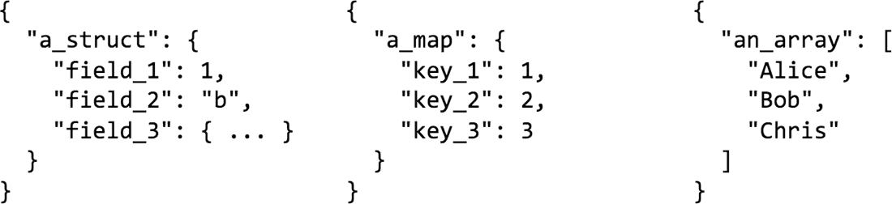

# Working with Complex Data Formats with Structured Streaming in Apache Spark 2.1

Part 2 of Scalable Data @ Databricks

In part 1 of this series on Structured Streaming blog posts, we demonstrated how easy it is to write an end-to-end streaming ETL pipeline using Structured Streaming that converts JSON CloudTrail logs into a Parquet table. The blog highlighted that one of the major challenges in building such pipelines is to read and transform data from various sources and complex formats. In this blog post, we are going to examine this problem in further detail, and show how Apache Spark SQL’s built-in functions can be used to solve all your data transformation challenges.

Specifically, we are going to discuss the following:

- What are the different data formats and their tradeoffs
- How to work with them easily using Spark SQL
- How to choose the right final format for your use case

## Data sources and formats

Data is available in a myriad of different formats. Spreadsheets can be expressed in XML, CSV, TSV; application metrics can be written out in raw text or JSON. Every use case has a particular data format tailored for it. In the world of Big Data, we commonly come across formats like Parquet, ORC, Avro, JSON, CSV, SQL and NoSQL data sources, and plain text files. We can broadly classify these data formats into three categories: structured, semi-structured, and unstructured data. Let’s try to understand the benefits and shortcomings of each category.



### Structured data

Structured data sources define a schema on the data. With this extra bit of information about the underlying data, structured data sources provide efficient storage and performance. For example, columnar formats such as Parquet and ORC make it much easier to extract values from a subset of columns. Reading each record row by row first, then extracting the values from the specific columns of interest can read much more data than what is necessary when a query is only interested in a small fraction of the columns. A row-based storage format such as Avro efficiently serializes and stores data providing storage benefits. However, these advantages often come at the cost of flexibility. For example, because of rigidity in structure, evolving a schema can be challenging.

### Unstructured data

By contrast, unstructured data sources are generally free-form text or binary objects that contain no markup, or metadata (e.g., commas in CSV files), to define the organization of data. Newspaper articles, medical records, image blobs, application logs are often treated as unstructured data. These sorts of sources generally require context around the data to be parseable. That is, you need to know that the file is an image or is a newspaper article. Most sources of data are unstructured. The cost of having unstructured formats is that it becomes cumbersome to extract value out of these data sources as many transformations and feature extraction techniques are required to interpret these datasets.

### Semi-structured data

Semi-structured data sources are structured per record but don’t necessarily have a well-defined global schema spanning all records. As a result, each data record is augmented with its schema information. JSON and XML are popular examples. The benefits of semi-structured data formats are that they provide the most flexibility in expressing your data as each record is self-describing. These formats are very common across many applications as many lightweight parsers exist for dealing with these records, and they also have the benefit of being human readable. However, the main drawback for these formats is that they incur extra parsing overheads, and are not particularly built for ad-hoc querying.

## Interchanging data formats with Spark SQL

In our previous blog post, we discussed how transforming Cloudtrail Logs from JSON into Parquet shortened the runtime of our ad-hoc queries by 10x. Spark SQL allows users to ingest data from these classes of data sources, both in batch and streaming queries. It natively supports reading and writing data in Parquet, ORC, JSON, CSV, and text format and a plethora of other connectors exist on Spark Packages. You may also connect to SQL databases using the JDBC DataSource.

Apache Spark can be used to interchange data formats as easily as:

```scala
events = spark.readStream \
  .format("json") \           # or parquet, kafka, orc...
  .option() \                 # format specific options
  .schema(my_schema) \        # required
  .load("path/to/data")

output = …                   # perform your transformations

output.writeStream \          # write out your data
  .format("parquet") \
  .start("path/to/write")
```

Whether batch or streaming data, we know how to read and write to different data sources and formats, but different sources support different kinds of schema and data types. Traditional databases only support primitive data types, whereas formats like JSON allow users to nest objects within columns, have an array of values or represent a set of key-value pairs. Users will generally have to go in-between these data types to efficiently store and represent their data. Fortunately, Spark SQL makes it easy to handle both primitive and complex data types. Let’s now dive into a quick overview of how we can go from complex data types to primitive data types and vice-a-versa.

## Transforming complex data types



It is common to have complex data types such as structs, maps, and arrays when working with semi-structured formats. For example, you may be logging API requests to your web server. This API request will contain HTTP Headers, which would be a string-string map. The request payload may contain form-data in the form of JSON, which may contain nested fields or arrays. Some sources or formats may or may not support complex data types. Some formats may provide performance benefits when storing the data in a specific data type. For example, when using Parquet, all struct columns will receive the same treatment as top-level columns. Therefore, if you have filters on a nested field, you will get the same benefits as a top-level column. However, maps are treated as two array columns, hence you wouldn’t receive efficient filtering semantics.

Let’s look at some examples on how Spark SQL allows you to shape your data ad libitum with some data transformation techniques.

#### Selecting from nested columns

Dots (`.`) can be used to access nested columns for structs and maps.

    // input
    {
      "a": {
        "b": 1
      }
    }

    Python: events.select("a.b")
     Scala: events.select("a.b")
       SQL: select a.b from events

    // output
    {
      "b": 1
    }

#### Flattening structs

A star (`*`) can be used to select all of the subfields in a struct.

    // input
    {
      "a": {
        "b": 1,
        "c": 2
      }
    }

    Python: events.select("a.*")
     Scala: events.select("a.*")
       SQL: select a.* from events

    // output
    {
      "b": 1,
      "c": 2
    }

#### Nesting columns

The struct function or just parentheses in SQL can be used to create a new struct.

    // input
    {
      "a": 1,
      "b": 2,
      "c": 3
    }

    Python: events.select(struct(col("a").alias("y")).alias("x"))
     Scala: events.select(struct('a as 'y) as 'x)
       SQL: select named_struct("y", a) as x from events

    // output
    {
      "x": {
        "y": 1
      }
    }

#### Nesting all columns

The star (`*`) can also be used to include all columns in a nested struct.

    // input
    {
      "a": 1,
      "b": 2
    }

    Python: events.select(struct("*").alias("x"))
     Scala: events.select(struct("*") as 'x)
       SQL: select struct(*) as x from events

    // output
    {
      "x": {
        "a": 1,
        "b": 2
      }
    }

#### Selecting a single array or map element

`getItem()` or square brackets (i.e. `[ ]`) can be used to select a single element out of an array or a map.

    // input
    {
      "a": [1, 2]
    }

    Python: events.select(col("a").getItem(0).alias("x"))
     Scala: events.select('a.getItem(0) as 'x)
       SQL: select a[0] as x from events

    // output
    { "x": 1 }

    // input
    {
      "a": {
        "b": 1
      }
    }

    Python: events.select(col("a").getItem("b").alias("x"))
     Scala: events.select('a.getItem("b") as 'x)
       SQL: select a['b'] as x from events

    // output
    { "x": 1 }

#### Creating a row for each array or map element

`explode()` can be used to create a new row for each element in an array or each key-value pair. This is similar to `LATERAL VIEW EXPLODE` in HiveQL.

    // input
    {
      "a": [1, 2]
    }

    Python: events.select(explode("a").alias("x"))
     Scala: events.select(explode('a) as 'x)
       SQL: select explode(a) as x from events

    // output
    [{ "x": 1 }, { "x": 2 }]

    // input
    {
      "a": {
        "b": 1,
        "c": 2
      }
    }

    Python: events.select(explode("a").alias("x", "y"))
     Scala: events.select(explode('a) as Seq("x", "y"))
       SQL: select explode(a) as (x, y) from events

    // output
    [{ "x": "b", "y": 1 }, { "x": "c", "y": 2 }]

#### Collecting multiple rows into an array

`collect_list()` and `collect_set()` can be used to aggregate items into an array.

    // input
    [{ "x": 1 }, { "x": 2 }]

    Python: events.select(collect_list("x").alias("x"))
     Scala: events.select(collect_list('x) as 'x)
       SQL: select collect_list(x) as x from events

    // output
    { "x": [1, 2] }

    // input
    [{ "x": 1, "y": "a" }, { "x": 2, "y": "b" }]

    Python: events.groupBy("y").agg(collect_list("x").alias("x"))
     Scala: events.groupBy("y").agg(collect_list('x) as 'x)
       SQL: select y, collect_list(x) as x from events group by y

    // output
    [{ "y": "a", "x": [1]}, { "y": "b", "x": [2]}]

#### Selecting one field from each item in an array

When you use dot notation on an array we return a new array where that field has been selected from each array element.

    // input
    {
      "a": [
        {"b": 1},
        {"b": 2}
      ]
    }

    Python: events.select("a.b")
     Scala: events.select("a.b")
       SQL: select a.b from events

    // output
    {
      "b": [1, 2]
    }

### Power of `to_json()` and `from_json()`

What if you really want to preserve your column’s complex structure but you need it to be encoded as a string to store it? Are you doomed? Of course not! Spark SQL provides functions like `to_json()` to encode a struct as a string and `from_json()` to retrieve the struct as a complex type. Using JSON strings as columns are useful when reading from or writing to a streaming source like Kafka. Each Kafka key-value record will be augmented with some metadata, such as the ingestion timestamp into Kafka, the offset in Kafka, etc. If the "value" field that contains your data is in JSON, you could use from_json() to extract your data, enrich it, clean it, and then push it downstream to Kafka again or write it out to a file.

#### Encode a struct as json

`to_json()` can be used to turn structs into JSON strings. This method is particularly useful when you would like to re-encode multiple columns into a single one when writing data out to Kafka. This method is not presently available in SQL.

    // input
    {
      "a": {
        "b": 1
      }
    }

    Python: events.select(to_json("a").alias("c"))
     Scala: events.select(to_json('a) as 'c)

    // output
    {
      "c": "{\"b\":1}"
    }

#### Decode json column as a struct

`from_json()` can be used to turn a string column with JSON data into a struct. Then you may flatten the struct as described above to have individual columns. This method is not presently available in SQL.

    // input
    {
      "a": "{\"b\":1}"
    }

    Python:
      schema = StructType().add("b", IntegerType())
      events.select(from_json("a", schema).alias("c"))
    Scala:
      val schema = new StructType().add("b", IntegerType)
      events.select(from_json('a, schema) as 'c)

    // output
    {
      "c": {
        "b": 1
      }
    }

Sometimes you may want to leave a part of the JSON string still as JSON to avoid too much complexity in your schema.

    // input
    {
      "a": "{\"b\":{\"x\":1,\"y\":{\"z\":2}}}"
    }

    Python:
      schema = StructType().add("b", StructType().add("x", IntegerType())
                           .add("y", StringType()))
      events.select(from_json("a", schema).alias("c"))
    Scala:
      val schema = new StructType().add("b", new StructType().add("x", IntegerType)
                                   .add("y", StringType))
      events.select(from_json('a, schema) as 'c)

    // output
    {
      "c": {
        "b": {
          "x": 1,
          "y": "{\"z\":2}"
        }
      }
    }

#### Parse a set of fields from a column containing JSON

`json_tuple()` can be used to extract fields available in a string column with JSON data.

    // input
    {
      "a": "{\"b\":1}"
    }

    Python: events.select(json_tuple("a", "b").alias("c"))
     Scala: events.select(json_tuple('a, "b") as 'c)
       SQL: select json_tuple(a, "b") as c from events

    // output
    { "c": 1 }

Sometimes a string column may not be self-describing as JSON, but may still have a well-formed structure. For example, it could be a log message generated using a specific Log4j format. Spark SQL can be used to structure those strings for you with ease!

#### Parse a well-formed string column

`regexp_extract()` can be used to parse strings using regular expressions.

    // input
    [{ "a": "x: 1" }, { "a": "y: 2" }]

    Python: events.select(regexp_extract("a", "([a-z]):", 1).alias("c"))
     Scala: events.select(regexp_extract('a, "([a-z]):", 1) as 'c)
       SQL: select regexp_extract(a, "([a-z]):", 1) as c from events

    // output
    [{ "c": "x" }, { "c": "y" }]

That’s a lot of transformations! Let’s now look at some real life use cases to put all of these data formats, and data manipulation capabilities to good use.

## Harnessing all of this power

At Databricks, we collect logs from our services and use them to perform real-time monitoring to detect issues, before our customers are affected. Log files are unstructured files, but they are parseable because they have a well-defined Log4j format. We run a log collector service that sends each log entry and additional metadata about the entry (e.g. source) in JSON to Kinesis. These JSON records are then batch-uploaded to S3 as files. Querying these JSON logs to answer any question is tedious: these files contain duplicates, and for answering any query, even if it involves a single column, the whole JSON record may require deserialization.

To address this issue, we run a pipeline that reads these JSON records and performs de-duplication on the metadata. Now we are left with the original log record, which may be in JSON format or as unstructured text. If we’re dealing with JSON, we use from_json() and several of the transformations described above to format our data. If it is text, we use methods such as regexp_extract() to parse our Log4j format into a more structured form. Once we are done with all of our transformations and restructuring, we save the records in Parquet partitioned by date. This gives us 10-100x speed-up when answering questions like "how many ERROR messages did we see between 10:00-10:30 for this specific service"? The speed-ups can be attributed to:

- We no longer pay the price of deserializing JSON records
- We don’t have to perform complex string comparisons on the original log message
- We only have to extract two columns in our query: the time, and the log level

Here are a few more common use cases that we have seen among our customers:

> "I would like to run a Machine Learning pipeline with my data. My data is already pre-processed, and I will use all my features throughout the pipeline."

Avro is a good choice when you will access the whole row of data.

> "I have an IoT use case where my sensors send me events. For each event the metadata that matters is different."

In cases where you would like flexibility in your schema, you may consider using JSON to store your data.

> "I would like to train a speech recognition algorithm on newspaper articles or sentiment analysis on product comments."

In cases where your data may not have a fixed schema, nor a fixed pattern/structure, it may just be easier to store it as plain text files. You may also have a pipeline that performs feature extraction on this unstructured data and stores it as Avro in preparation for your Machine Learning pipeline.

## Conclusion

In this blog post, we discussed how Spark SQL allows you to consume data from many sources and formats, and easily perform transformations and interchange between these data formats. We shared how we curate our data at Databricks, and considered other production use cases where you may want to do things differently.

Spark SQL provides you with the necessary tools to access your data wherever it may be, in whatever format it may be in and prepare it for downstream applications either with low latency on streaming data or high throughput on old historical data!

In the future blog posts in this series, we’ll cover more on:

- Monitoring your streaming applications
- Integrating Structured Streaming with Apache Kafka
- Computing event time aggregations with Structured Streaming

If you want to learn more about the Structured Streaming, here are a few useful links.

- Previous blogs posts explaining the motivation and concepts of Structured Streaming:
  - Continuous Applications: Evolving Streaming in Apache Spark 2.0
  - Structured Streaming In Apache Spark
- Processing Data in Apache Kafka with Structured Streaming in Apache Spark 2.2
  - Real-time Streaming ETL with Structured Streaming in Apache Spark 2.1
- Structured Streaming Programming Guide
- Talk at Spark Summit 2017 East -- Making Structured Streaming Ready for Production and Future Directions
