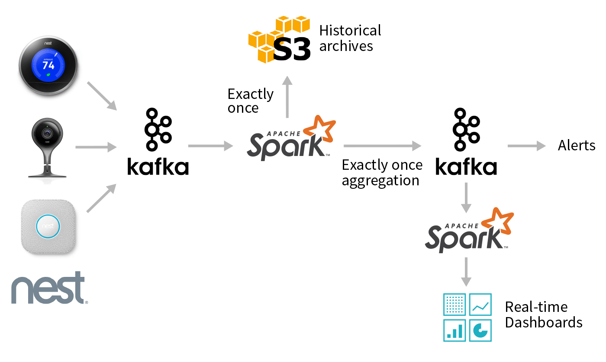

＃使用Apache Spark 2.2中的结构化流处理Apache Kafka中的数据

可伸缩数据@ Databricks的第3部分

在此博客中，我们将展示如何利用Spark SQL的API来使用和转换来自Apache Kafka的复杂数据流。使用这些简单的API，您可以表达复杂的转换，例如一次准确的事件时间聚合，并将结果输出到各种系统。您可以一起使用Apache Spark和Apache Kafka：

-使用与批处理数据相同的API转换和扩充从Apache Kafka读取的实时数据。
-将从Kafka读取的数据与存储在其他系统（包括S3，HDFS或MySQL）中的信息进行集成。
-自动受益于Catalyst优化程序提供的增量执行以及Tungsten随后高效的代码生成。

我们首先回顾一下Kafka术语，然后介绍结构化流查询的示例，这些查询从Apache Kafka读取数据或向Apache Kafka写入数据。最后，我们将探索一个端到端的实际用例。

## Apache Kafka

Kafka是一种分布式的pub-sub消息传递系统，广泛用于摄取实时数据流，并以并行且容错的方式将其提供给下游使用者。这使得Kafka适用于构建实时流数据管道，以在异构处理系统之间可靠地移动数据。在深入探讨Structured Streaming对Kafka支持的细节之前，让我们先回顾一些基本概念和术语。

Kafka中的数据被组织成主题，这些主题被分为多个分区以实现并行性。每个分区都是有序的，不可变的记录序列，可以视为结构化的提交日志。生产者将记录附加到这些日志的末尾，而消费者则按照自己的节奏阅读日志。多个使用者可以订阅一个主题，并在到达时接收传入的记录。当新记录到达Kafka主题中的分区时，会为它们分配一个连续的ID号，称为偏移量。 Kafka群集会在可配置的保留期内保留所有已发布的记录（无论是否已被使用），之后将其标记为删除。
指定要从Kafka读取什么数据


Kafka主题可以看作是无限流，其中数据保留了一段可配置的时间。该流的无限性质意味着在开始新查询时，我们必须首先决定要读取哪些数据以及在什么时间开始。在较高的级别上，有三个选择：

-_最早_-在流的开头开始阅读。这不包括已从Kafka删除的数据，因为它早于保留期限（“过期”数据）。
-_latest_-从现在开始，仅处理查询开始后到达的新数据。
-_每个分区的分配_-为每个分区指定从其开始的精确偏移量，从而可以精确地控制应从何处开始处理。例如，如果我们要准确地选择其他系统或查询的中断位置，则可以利用此选项。

如下所示，startingOffsets选项接受上面三个选项之一，并且仅在从新检查点开始查询时使用。如果从现有检查点重新开始查询，则该查询将始终从其上次中断的地方继续正确恢复，除非该偏移量处的数据已过期。如果任何未处理的数据过期，查询行为将取决于failOnDataLoss选项设置的内容，该选项在《 Kafka集成指南》中进行了描述。

KafkaConsumer的现有用户会注意到，结构化流提供了更详细的配置选项版本，即auto.offset.reset。我们将这些问题分为两个不同的参数，而不是一个选项：一个参数表示流首次启动时的操作（startingOffsets），另一个参数处理如果查询无法从其离开的地方进行处理的情况。关闭，因为所需数据已过期（failOnDataLoss）。

## Apache Kafka在结构化流中的支持

结构化流提供了统一的批处理和流API，使我们能够查看作为DataFrame发布到Kafka的数据。当以流方式处理无边界数据时，我们使用与批处理中相同的API并获得相同的数据一致性保证。该系统可确保端到端的一次容错保证，因此用户无需推理流的低级方面。

让我们研究和探索读和写Kafka的示例，然后再介绍一个端到端的应用程序。

### 阅读卡夫卡主题的记录

第一步是指定我们的Kafka集群的位置以及我们感兴趣的主题。 Spark允许您阅读单个主题，特定主题集，主题的正则表达式模式，甚至是属于一组主题的特定分区集。我们将只看一个从单个主题中读取的示例，《 Kafka集成指南》中介绍了其他可能性。

```python
# Construct a streaming DataFrame that reads from topic1
df = spark \
 .readStream \
 .format("kafka") \
 .option("kafka.bootstrap.servers", "host1:port1,host2:port2") \
 .option("subscribe", "topic1") \
 .option("startingOffsets", "earliest") \
 .load()
```

上面的DataFrame是已订阅“ topic1”的流式DataFrame。通过为DataStreamReader提供选项来设置配置，所需的最少参数是kafka.bootstrap.servers的位置（即“ host：port”）和我们要订阅的主题。在这里，我们还指定了startoffsets为“最早的”，它将在查询开始时读取该主题中的所有可用数据。如果未指定startingOffsets选项，则使用默认值“ latest”，并且仅处理查询开始后到达的数据。

`df.printSchema()` 揭示了我们的DataFrame的架构。

    root
    |-- key: binary (nullable = true)
    |-- value: binary (nullable = true)
    |-- topic: string (nullable = true)
    |-- partition: integer (nullable = true)
    |-- offset: long (nullable = true)
    |-- timestamp: timestamp (nullable = true)
    |-- timestampType: integer (nullable = true)

返回的DataFrame包含Kafka记录的所有熟悉字段及其关联的元数据。现在，我们可以使用所有熟悉的DataFrame或Dataset操作来转换结果。不过，通常情况下，我们将从解析键和值列中存在的二进制值开始。如何解释这些斑点是特定于应用程序的。幸运的是，Spark SQL包含许多内置的用于常见序列化类型的转换，如下所示。

####数据存储为UTF8字符串

如果Kafka记录的字节表示UTF8字符串，我们可以简单地使用强制转换将二进制数据转换为正确的类型。

    df.selectExpr("CAST(key AS STRING)", "CAST(value AS STRING)")

####数据存储为JSON

JSON是写入Kafka的另一种常见数据格式。在这种情况下，我们可以使用内置的from_json函数以及预期的架构将二进制值转换为Spark SQL结构。

```python
# value schema: { "a": 1, "b": "string" }
schema = StructType().add("a", IntegerType()).add("b", StringType())
df.select( \
  col("key").cast("string"),
  from_json(col("value").cast("string"), schema))
```

####用户定义的序列化器和反序列化器

在某些情况下，您可能已经具有实现Kafka Deserializer接口的代码。您可以通过使用以下所示的Scala代码将其包装为用户定义的函数（UDF）来利用此代码。

```scala
object MyDeserializerWrapper {
  val deser = new MyDeserializer
}
spark.udf.register("deserialize", (topic: String, bytes: Array[Byte]) =>
  MyDeserializerWrapper.deser.deserialize(topic, bytes)
)

df.selectExpr("""deserialize("topic1", value) AS message""")
```

注意，上面的DataFrame代码类似于在使用标准Kafka使用者时指定`value.deserializer`。

###使用Spark作为Kafka生产者

从任何受Spark支持的数据源将数据写入Kafka就像在任何包含名为“值”的列以及可选地名为“键”的列的DataFrame上调用writeStream一样简单。如果未指定键列，则将自动添加空值键列。在某些情况下，空值键列可能会导致Kafka中的数据分区不均匀，因此应谨慎使用。

可以将DataFrame的记录的目标主题静态指定为DataStreamWriter的选项，也可以将每个记录作为DataFrame中名为“ topic”的列进行指定。

```python
# Write key-value data from a DataFrame to a Kafka topic specified in an option
query = df \
  .selectExpr("CAST(userId AS STRING) AS key", "to_json(struct(*)) AS value") \
  .writeStream \
  .format("kafka") \
  .option("kafka.bootstrap.servers", "host1:port1,host2:port2") \
  .option("topic", "topic1") \
  .option("checkpointLocation", "/path/to/HDFS/dir") \
  .start()
```

上面的查询使用一个包含用户信息的DataFrame并将其写入Kafka。 userId被序列化为字符串并用作密钥。我们使用DataFrame的所有列，并将它们序列化为JSON字符串，将结果放入记录的值中。

写入Kafka的两个必需选项是kafka.bootstrap.servers和checkpointLocation。 如上面的示例所示，可以使用其他主题选项来设置要写入的单个主题，并且该选项将覆盖“主题”列（如果它存在于DataFrame中）。

## Nest设备的端到端示例

在本节中，我们将探讨涉及Kafka以及其他数据源和接收器的端到端管道。 我们将处理一个包含Nest设备日志集合的数据集，此处描述的是JSON格式。 我们将专门检查Nest相机中的数据，这些数据类似于以下JSON：

```plain
"devices": {
    "cameras": {
        "device_id": "awJo6rH...",
        "last_event": {
        "has_sound": true,
        "has_motion": true,
        "has_person": true,
        "start_time": "2016-12-29T00:00:00.000Z",
        "end_time": "2016-12-29T18:42:00.000Z"
        }
    }
}
```

我们还将加入一个静态数据集（称为“ device_locations”），其中包含从device_id到设备注册所在邮编的映射。



总体而言，所需的工作流程类似于上图。给定Nest相机提供的更新流，我们想使用Spark执行几个不同的任务：

- 使用Parquet等列格式创建所有事件的高效，可查询的历史档案。
- 执行低延迟事件时间聚合，并将结果推回给其他消费者使用的Kafka。
- 对存储在Kafka中压缩主题中的数据执行批量报告。

尽管这些听起来像是完全不同的用例，但您可以在单个端到端Spark应用程序中使用DataFrame和结构化流来执行所有这些用例！在以下各节中，我们将逐步介绍从摄取到处理到存储汇总结果的各个步骤。

###从Kafka读取Nest设备日志

我们的第一步是从Kafka读取原始Nest数据流，并投影出我们感兴趣的相机数据。我们首先通过调用`from_json`函数并提供期望的JSON模式，从Kafka记录中解析Nest JSON。时间戳格式。然后，我们对数据进行各种转换，并投影与相机数据有关的列，以简化后面各节中的数据处理。

#### JSON数据的预期架构

```python
schema = StructType() \
  .add("metadata", StructType() \
    .add("access_token", StringType()) \
    .add("client_version", IntegerType())) \
  .add("devices", StructType() \
    .add("thermostats", MapType(StringType(), StructType().add(...))) \
    .add("smoke_co_alarms", MapType(StringType(), StructType().add(...))) \
    .add("cameras", MapType(StringType(), StructType().add(...))) \
    .add("companyName", StructType().add(...))) \
  .add("structures", MapType(StringType(), StructType().add(...)))

nestTimestampFormat = "yyyy-MM-dd'T'HH:mm:ss.sss'Z'"
```

#### Parse the Raw JSON

```python
jsonOptions = { "timestampFormat": nestTimestampFormat }
parsed = spark \
  .readStream \
  .format("kafka") \
  .option("kafka.bootstrap.servers", "localhost:9092") \
  .option("subscribe", "nest-logs") \
  .load() \
  .select(from_json(col("value").cast("string"), schema, jsonOptions).alias("parsed_value"))
```

#### Project Relevant Columns

```python
camera = parsed \
  .select(explode("parsed_value.devices.cameras")) \
  .select("value.*")

sightings = camera \
  .select("device_id", "last_event.has_person", "last_event.start_time") \
  .where(col("has_person") == True)
```

为了创建`camera`数据框，我们首先将“ cameras” json字段嵌套，使其成为顶级。 由于“相机”是MapType，因此每个结果行都包含键/值对的映射。 因此，我们使用`explode`函数为每个键值对创建一个新行，以将数据展平。 最后，我们使用`star（）`取消嵌套“值”列。 以下是调用`camera.printSchema（）`的结果。

    root
     |-- device_id: string (nullable = true)
     |-- software_version: string (nullable = true)
     |-- structure_id: string (nullable = true)
     |-- where_id: string (nullable = true)
     |-- where_name: string (nullable = true)
     |-- name: string (nullable = true)
     |-- name_long: string (nullable = true)
     |-- is_online: boolean (nullable = true)
     |-- is_streaming: boolean (nullable = true)
     |-- is_audio_input_enable: boolean (nullable = true)
     |-- last_is_online_change: timestamp (nullable = true)
     |-- is_video_history_enabled: boolean (nullable = true)
     |-- web_url: string (nullable = true)
     |-- app_url: string (nullable = true)
     |-- is_public_share_enabled: boolean (nullable = true)
     |-- activity_zones: array (nullable = true)
     |    |-- element: struct (containsNull = true)
     |    |    |-- name: string (nullable = true)
     |    |    |-- id: string (nullable = true)
     |-- public_share_url: string (nullable = true)
     |-- snapshot_url: string (nullable = true)
     |-- last_event: struct (nullable = true)
     |    |-- has_sound: boolean (nullable = true)
     |    |-- has_motion: boolean (nullable = true)
     |    |-- has_person: boolean (nullable = true)
     |    |-- start_time: timestamp (nullable = true)
     |    |-- end_time: timestamp (nullable = true)
     |    |-- urls_expire_time: timestamp (nullable = true)
     |    |-- web_url: string (nullable = true)
     |    |-- app_url: string (nullable = true)
     |    |-- image_url: string (nullable = true)
     |    |-- animated_image_url: string (nullable = true)
     |    |-- activity_zone_ids: array (nullable = true)
     |    |    |-- element: string (containsNull = true)

###汇总并写回Kafka

现在，我们将通过扩大每个瞄准点的位置来处理“瞄准”数据框。 回想一下，我们有一些位置数据，可以通过它的设备ID查找设备的邮政编码。 我们首先创建一个表示该位置数据的DataFrame，然后将其与“ sightings” DataFrame结合在一起，并根据设备ID进行匹配。 我们在这里所做的就是将_streaming_ DataFrame`sightings`与位置的_static_ DataFrame结合起来！

####添加位置数据

```python
locationDF = spark.table("device_locations").select("device_id", "zip_code")
sightingLoc = sightings.join(locationDF, "device_id")
```

####汇总统计信息并写出到Kafka

现在，让我们生成一个流式聚合，统计每个小时中每个邮政编码中摄像机人员目击的次数，并将其写到一个紧凑的Kafka主题1中，称为“巢状摄像机状态”。

```python
sightingLoc \
  .groupBy("zip_code", window("start_time", "1 hour")) \
  .count() \
  .select( \
    to_json(struct("zip_code", "window")).alias("key"),
    col("count").cast("string").alias("value")) \
  .writeStream \
  .format("kafka") \
  .option("kafka.bootstrap.servers", "localhost:9092") \
  .option("topic", "nest-camera-stats") \
  .option("checkpointLocation", "/path/to/HDFS/dir") \
  .outputMode("complete") \
  .start()
```

上面的查询将处理发生的任何目击事件，并将目击事件的更新计数写到Kafka，键入在目击事件的邮政编码和小时窗口上。 随着时间的流逝，对同一密钥的许多更新将导致使用该密钥的许多记录，并且随着密钥的新值到达，Kafka主题压缩将删除较旧的更新。 通过这种方式，压缩尝试确保最终对于任何给定的密钥仅保留最新的值。

###在永久存储中归档结果

除了将汇总结果写出到Kafka之外，我们可能还希望将原始摄像机记录保存在持久性存储中以供以后使用。 以下示例将Parcam格式的`camera`数据帧写入S3。 我们选择Parquet进行压缩和柱状存储，尽管支持许多不同的格式（例如ORC，Avro，CSV等）以适应各种用例。

```python
camera.writeStream \
  .format("parquet") \
  .option("startingOffsets", "earliest") \
  .option("path", "s3://nest-logs") \
  .option("checkpointLocation", "/path/to/HDFS/dir") \
  .start()
```

注意，我们可以简单地重用相同的“ camera” DataFrame来启动多个流查询。 例如，我们可以查询DataFrame以获得脱机的摄像机列表，然后向网络运营中心发送通知以进行进一步调查。

###报表批量查询

我们的下一个示例将对压缩的Kafka“ nest-camera-stats”主题进行批处理查询，并生成一个报告，显示带有大量目击者的邮政编码。

编写批处理查询与流查询类似，不同之处在于，我们使用read方法代替了readStream方法，而使用了read方法，而不是使用了writeStream方法。

####批量读取和格式化数据

```python
report = spark \
  .read \
  .format("kafka") \
  .option("kafka.bootstrap.servers", "localhost:9092") \
  .option("subscribe", "nest-camera-stats") \
  .load() \
  .select( \
    json_tuple(col("key").cast("string"), "zip_code", "window").alias("zip_code", "window"),
    col("value").cast("string").cast("integer").alias("count")) \
  .where("count > 1000") \
  .select("zip_code", "window") \
  .distinct()
```

此报告DataFrame可用于报告或创建实时仪表板，以显示具有极端目击事件的事件。

##结论

在此博客文章中，我们展示了使用和转换Kafka实时数据流的示例。我们实现了一个连续应用程序的端到端示例，展示了使用结构化流API进行编程的简洁性和易用性，同时充分利用了这些API提供的强大的一次精确语义。

在本系列的后续博客文章中，我们将介绍更多内容：

-监控您的流媒体应用程序
-使用结构化流计算事件时间聚合

如果您想了解有关结构化流的更多信息，这里有一些有用的链接：

-以前的博客文章解释了结构化流的动机和概念：
  -连续应用程序：Apache Spark 2.0中不断发展的流
  -Apache Spark中的结构化流
  -Apache Spark 2.1中具有结构化流的实时流ETL
  -在Apache Spark 2.1中使用结构化流处理复杂
-结构化流媒体编程指南
-在东部Spark Summit 2017上的演讲-使结构化流媒体为生产和未来发展做好准备

##其他配置

[Kafka集成指南]（https://spark.apache.org/docs/latest/structured-streaming-kafka-integration.html）

包含更多示例以及用于在Kafka中处理数据的Spark特定配置选项。

Kafka [消费者]（http://kafka.apache.org/documentation.html#newconsumerconfigs）和[生产者]（http://kafka.apache.org/documentation/#producerconfigs）配置文档

Kafka自己的配置可以通过带有Kafka的“ DataStreamReader.option”和“ DataStreamWriter.option”进行设置。前缀，例如：

    stream.option（“ kafka.bootstrap.servers”，“ host：port”）

有关可能的“ kafka”参数，请参阅[Kafka使用者配置]（http://kafka.apache.org/documentation.html#newconsumerconfigs）文档，以获取与读取数据相关的参数，以及Kafka生产者配置文档，以获取与写入相关的参数。数据。

请参阅[Kafka集成指南]（https://spark.apache.org/docs/latest/structured-streaming-kafka-integration.html），以了解由Spark管理的选项列表，因此无法配置。

