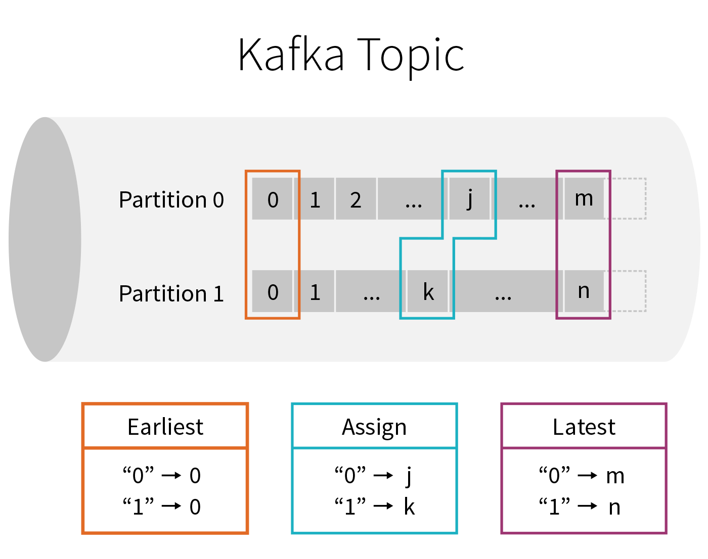

# Processing Data in Apache Kafka with Structured Streaming in Apache Spark 2.2

Part 3 of Scalable Data @ Databricks

In this blog, we will show how Spark SQL’s APIs can be leveraged to consume and transform complex data streams from Apache Kafka. Using these simple APIs, you can express complex transformations like exactly-once event-time aggregation and output the results to a variety of systems. Together, you can use Apache Spark and Apache Kafka to:

- Transform and augment real-time data read from Apache Kafka using the same APIs as working with batch data.
- Integrate data read from Kafka with information stored in other systems including S3, HDFS, or MySQL.
- Automatically benefit from incremental execution provided by the Catalyst optimizer and subsequent efficient code generation by Tungsten.

We start with a review of Kafka terminology and then present examples of Structured Streaming queries that read data from and write data to Apache Kafka. And finally, we’ll explore an end-to-end real-world use case.

## Apache Kafka

Kafka is a distributed pub-sub messaging system that is popular for ingesting real-time data streams and making them available to downstream consumers in a parallel and fault-tolerant manner. This renders Kafka suitable for building real-time streaming data pipelines that reliably move data between heterogeneous processing systems. Before we dive into the details of Structured Streaming’s Kafka support, let’s recap some basic concepts and terms.

Data in Kafka is organized into topics that are split into partitions for parallelism. Each partition is an ordered, immutable sequence of records, and can be thought of as a structured commit log. Producers append records to the tail of these logs and consumers read the logs at their own pace. Multiple consumers can subscribe to a topic and receive incoming records as they arrive. As new records arrive to a partition in a Kafka topic, they are assigned a sequential id number called the offset. A Kafka cluster retains all published records-whether or not they have been consumed-for a configurable retention period, after which they are marked for deletion.
Specifying What Data to Read from Kafka



A Kafka topic can be viewed as an infinite stream where data is retained for a configurable amount of time. The infinite nature of this stream means that when starting a new query, we have to first decide what data to read and where in time we are going to begin. At a high level, there are three choices:

- _earliest_ - start reading at the beginning of the stream. This excludes data that has already been deleted from Kafka because it was older than the retention period ("aged out" data).
- _latest_ - start now, processing only new data that arrives after the query has started.
- _per-partition assignment_ - specify the precise offset to start from for every partition, allowing fine-grained control over exactly where processing should start. For example, if we want to pick up exactly where some other system or query left off, then this option can be leveraged.

As you will see below, the startingOffsets option accepts one of the three options above, and is only used when starting a query from a fresh checkpoint. If you restart a query from an existing checkpoint, then it will always resume exactly where it left off, except when the data at that offset has been aged out. If any unprocessed data was aged out, the query behavior will depend on what is set by the failOnDataLoss option, which is described in the Kafka Integration Guide.

Existing users of the KafkaConsumer will notice that Structured Streaming provides a more granular version of the configuration option, `auto.offset.reset`. Instead of one option, we split these concerns into two different parameters, one that says what to do when the stream is first starting (startingOffsets), and another that handles what to do if the query is not able to pick up from where it left off, because the desired data has already been aged out (failOnDataLoss).

## Apache Kafka support in Structured Streaming

Structured Streaming provides a unified batch and streaming API that enables us to view data published to Kafka as a DataFrame. When processing unbounded data in a streaming fashion, we use the same API and get the same data consistency guarantees as in batch processing. The system ensures end-to-end exactly-once fault-tolerance guarantees, so that a user does not have to reason about low-level aspects of streaming.

Let’s examine and explore examples of reading from and writing to Kafka, followed by an end-to-end application.

### Reading Records from Kafka topics

The first step is to specify the location of our Kafka cluster and which topic we are interested in reading from. Spark allows you to read an individual topic, a specific set of topics, a regex pattern of topics, or even a specific set of partitions belonging to a set of topics. We will only look at an example of reading from an individual topic, the other possibilities are covered in the Kafka Integration Guide.

```python
# Construct a streaming DataFrame that reads from topic1
df = spark \
 .readStream \
 .format("kafka") \
 .option("kafka.bootstrap.servers", "host1:port1,host2:port2") \
 .option("subscribe", "topic1") \
 .option("startingOffsets", "earliest") \
 .load()
```

The DataFrame above is a streaming DataFrame subscribed to "topic1". The configuration is set by providing options to the DataStreamReader, and the minimal required parameters are the location of the kafka.bootstrap.servers (i.e. `host:port`) and the topic that we want to subscribe to. Here, we have also specified startingOffsets to be "earliest", which will read all data available in the topic at the start of the query. If the startingOffsets option is not specified, the default value of "latest" is used and only data that arrives after the query starts will be processed.

`df.printSchema()` reveals the schema of our DataFrame.

    root
    |-- key: binary (nullable = true)
    |-- value: binary (nullable = true)
    |-- topic: string (nullable = true)
    |-- partition: integer (nullable = true)
    |-- offset: long (nullable = true)
    |-- timestamp: timestamp (nullable = true)
    |-- timestampType: integer (nullable = true)

The returned DataFrame contains all the familiar fields of a Kafka record and its associated metadata. We can now use all of the familiar DataFrame or Dataset operations to transform the result. Typically, however, we’ll start by parsing the binary values present in the key and value columns. How to interpret these blobs is application specific. Fortunately, Spark SQL contains many built-in transformations for common types of serialization as we’ll show below.

#### Data Stored as a UTF8 String

If the bytes of the Kafka records represent UTF8 strings, we can simply use a cast to convert the binary data into the correct type.

    df.selectExpr("CAST(key AS STRING)", "CAST(value AS STRING)")

#### Data Stored as JSON

JSON is another common format for data that is written to Kafka. In this case, we can use the built-in from_json function along with the expected schema to convert a binary value into a Spark SQL struct.

```python
# value schema: { "a": 1, "b": "string" }
schema = StructType().add("a", IntegerType()).add("b", StringType())
df.select( \
  col("key").cast("string"),
  from_json(col("value").cast("string"), schema))
```

#### User Defined Serializers and Deserializers

In some cases, you may already have code that implements the Kafka Deserializer interface. You can take advantage of this code by wrapping it as a user defined function (UDF) using the Scala code shown below.

```scala
object MyDeserializerWrapper {
  val deser = new MyDeserializer
}
spark.udf.register("deserialize", (topic: String, bytes: Array[Byte]) =>
  MyDeserializerWrapper.deser.deserialize(topic, bytes)
)

df.selectExpr("""deserialize("topic1", value) AS message""")
```

Note that the DataFrame code above is analogous to specifying `value.deserializer` when using the standard Kafka consumer.

### Using Spark as a Kafka Producer

Writing data from any Spark supported data source into Kafka is as simple as calling `writeStream` on any DataFrame that contains a column named "value", and optionally a column named "key". If a key column is not specified, then a null valued key column will be automatically added. A null valued key column may, in some cases, lead to uneven data partitioning in Kafka, and should be used with care.

The destination topic for the records of the DataFrame can either be specified statically as an option to the `DataStreamWriter` or on a per-record basis as a column named "topic" in the DataFrame.

```python
# Write key-value data from a DataFrame to a Kafka topic specified in an option
query = df \
  .selectExpr("CAST(userId AS STRING) AS key", "to_json(struct(*)) AS value") \
  .writeStream \
  .format("kafka") \
  .option("kafka.bootstrap.servers", "host1:port1,host2:port2") \
  .option("topic", "topic1") \
  .option("checkpointLocation", "/path/to/HDFS/dir") \
  .start()
```

The above query takes a DataFrame containing user information and writes it to Kafka. The userId is serialized as a string and used as the key. We take all the columns of the DataFrame and serialize them as a JSON string, putting the results in the value of the record.

The two required options for writing to Kafka are the `kafka.bootstrap.servers` and the `checkpointLocation`. As in the above example, an additional topic option can be used to set a single topic to write to, and this option will override the "topic" column if it exists in the DataFrame.

## End-to-End Example with Nest Devices

In this section, we will explore an end-to-end pipeline involving Kafka along with other data sources and sinks. We will work with a data set involving a collection of Nest device logs, with a JSON format described here. We’ll specifically examine data from Nest’s cameras, which look like the following JSON:

    "devices": {
    "cameras": {
        "device_id": "awJo6rH...",
        "last_event": {
        "has_sound": true,
        "has_motion": true,
        "has_person": true,
        "start_time": "2016-12-29T00:00:00.000Z",
        "end_time": "2016-12-29T18:42:00.000Z"
        }
    }
    }

We’ll also be joining with a static dataset (called "device_locations") that contains a mapping from device_id to the zip_code where the device was registered.


At a high-level, the desired workflow looks like the graph above. Given a stream of updates from Nest cameras, we want to use Spark to perform several different tasks:

- Create an efficient, queryable historical archive of all events using a columnar format like Parquet.
- Perform low-latency event-time aggregation and push the results back to Kafka for other consumers.
- Perform batch reporting on the data stored in a compacted topic in Kafka.

While these may sound like wildly different use-cases, you can perform all of them using DataFrames and Structured Streaming in a single end-to-end Spark application! In the following sections, we’ll walk through individual steps, starting from ingest to processing to storing aggregated results.

### Read Nest Device Logs From Kafka

Our first step is to read the raw Nest data stream from Kafka and project out the camera data that we are interested in. We first parse the Nest JSON from the Kafka records, by calling the `from_json` function and supplying the expected JSON schema and timestamp format. Then, we apply various transformations to the data and project the columns related to camera data in order to simplify working with the data in the sections to follow.

#### Expected Schema for JSON data

```python
schema = StructType() \
  .add("metadata", StructType() \
    .add("access_token", StringType()) \
    .add("client_version", IntegerType())) \
  .add("devices", StructType() \
    .add("thermostats", MapType(StringType(), StructType().add(...))) \
    .add("smoke_co_alarms", MapType(StringType(), StructType().add(...))) \
    .add("cameras", MapType(StringType(), StructType().add(...))) \
    .add("companyName", StructType().add(...))) \
  .add("structures", MapType(StringType(), StructType().add(...)))

nestTimestampFormat = "yyyy-MM-dd'T'HH:mm:ss.sss'Z'"
```

#### Parse the Raw JSON

```python
jsonOptions = { "timestampFormat": nestTimestampFormat }
parsed = spark \
  .readStream \
  .format("kafka") \
  .option("kafka.bootstrap.servers", "localhost:9092") \
  .option("subscribe", "nest-logs") \
  .load() \
  .select(from_json(col("value").cast("string"), schema, jsonOptions).alias("parsed_value"))
```

#### Project Relevant Columns

```python
camera = parsed \
  .select(explode("parsed_value.devices.cameras")) \
  .select("value.*")

sightings = camera \
  .select("device_id", "last_event.has_person", "last_event.start_time") \
  .where(col("has_person") == True)
```

To create the `camera` DataFrame, we first unnest the "cameras" json field to make it top level. Since "cameras" is a MapType, each resulting row contains a map of key-value pairs. So, we use the `explode` function to create a new row for each key-value pair, flattening the data. Lastly, we use `star()` to unnest the "value" column. The following is the result of calling `camera.printSchema()`

    root
     |-- device_id: string (nullable = true)
     |-- software_version: string (nullable = true)
     |-- structure_id: string (nullable = true)
     |-- where_id: string (nullable = true)
     |-- where_name: string (nullable = true)
     |-- name: string (nullable = true)
     |-- name_long: string (nullable = true)
     |-- is_online: boolean (nullable = true)
     |-- is_streaming: boolean (nullable = true)
     |-- is_audio_input_enable: boolean (nullable = true)
     |-- last_is_online_change: timestamp (nullable = true)
     |-- is_video_history_enabled: boolean (nullable = true)
     |-- web_url: string (nullable = true)
     |-- app_url: string (nullable = true)
     |-- is_public_share_enabled: boolean (nullable = true)
     |-- activity_zones: array (nullable = true)
     |    |-- element: struct (containsNull = true)
     |    |    |-- name: string (nullable = true)
     |    |    |-- id: string (nullable = true)
     |-- public_share_url: string (nullable = true)
     |-- snapshot_url: string (nullable = true)
     |-- last_event: struct (nullable = true)
     |    |-- has_sound: boolean (nullable = true)
     |    |-- has_motion: boolean (nullable = true)
     |    |-- has_person: boolean (nullable = true)
     |    |-- start_time: timestamp (nullable = true)
     |    |-- end_time: timestamp (nullable = true)
     |    |-- urls_expire_time: timestamp (nullable = true)
     |    |-- web_url: string (nullable = true)
     |    |-- app_url: string (nullable = true)
     |    |-- image_url: string (nullable = true)
     |    |-- animated_image_url: string (nullable = true)
     |    |-- activity_zone_ids: array (nullable = true)
     |    |    |-- element: string (containsNull = true)

### Aggregate and Write Back to Kafka

We will now process the `sightings` DataFrame by augmenting each sighting with its location. Recall that we have some location data that lets us look up the zip code of a device by its device id. We first create a DataFrame representing this location data, and then join it with the `sightings` DataFrame, matching on device id. What we are doing here is joining the _streaming_ DataFrame `sightings` with a _static_ DataFrame of locations!

#### Add Location Data

```python
locationDF = spark.table("device_locations").select("device_id", "zip_code")
sightingLoc = sightings.join(locationDF, "device_id")
```

#### Aggregate Statistics and Write Out to Kafka

Now, let’s generate a streaming aggregate that counts the number of camera person sightings in each zip code for each hour, and write it out to a compacted Kafka topic1 called "nest-camera-stats".

```python
sightingLoc \
  .groupBy("zip_code", window("start_time", "1 hour")) \
  .count() \
  .select( \
    to_json(struct("zip_code", "window")).alias("key"),
    col("count").cast("string").alias("value")) \
  .writeStream \
  .format("kafka") \
  .option("kafka.bootstrap.servers", "localhost:9092") \
  .option("topic", "nest-camera-stats") \
  .option("checkpointLocation", "/path/to/HDFS/dir") \
  .outputMode("complete") \
  .start()
```

The above query will process any sighting as it occurs and write out the updated count of the sighting to Kafka, keyed on the zip code and hour window of the sighting. Over time, many updates to the same key will result in many records with that key, and Kafka topic compaction will delete older updates as new values arrive for the key. This way, compaction tries to ensure that eventually, only the latest value is kept for any given key.

### Archive Results in Persistent Storage

In addition to writing out aggregation results to Kafka, we may want to save the raw camera records in persistent storage for later use. The following example writes out the `camera` DataFrame to S3 in Parquet format. We have chosen Parquet for compression and columnar storage, though many different formats such as ORC, Avro, CSV, etc. are supported to tailor to varied use-cases.

```python
camera.writeStream \
  .format("parquet") \
  .option("startingOffsets", "earliest") \
  .option("path", "s3://nest-logs") \
  .option("checkpointLocation", "/path/to/HDFS/dir") \
  .start()
```

Note that we can simply reuse the same `camera` DataFrame to start multiple streaming queries. For instance, we can query the DataFrame to get a list of cameras that are offline, and send a notification to the network operations center for further investigation.

### Batch Query for Reporting

Our next example is going to run a batch query over the Kafka "nest-camera-stats" compacted topic and generate a report showing zip codes with a significant number of sightings.

Writing batch queries is similar to streaming queries with the exception that we use the `read` method instead of the `readStream` method and `write` instead of `writeStream`.

#### Batch Read and Format the Data

```python
report = spark \
  .read \
  .format("kafka") \
  .option("kafka.bootstrap.servers", "localhost:9092") \
  .option("subscribe", "nest-camera-stats") \
  .load() \
  .select( \
    json_tuple(col("key").cast("string"), "zip_code", "window").alias("zip_code", "window"),
    col("value").cast("string").cast("integer").alias("count")) \
  .where("count > 1000") \
  .select("zip_code", "window") \
  .distinct()
```

This report DataFrame can be used for reporting or to create a real-time dashboard showing events with extreme sightings.

## Conclusion

In this blog post, we showed examples of consuming and transforming real-time data streams from Kafka. We implemented an end-to-end example of a continuous application, demonstrating the conciseness and ease of programming with Structured Streaming APIs, while leveraging the powerful exactly-once semantics these APIs provide.

In the future blog posts in this series, we’ll cover more on:

- Monitoring your streaming applications
- Computing event-time aggregations with Structured Streaming

If you want to learn more about the Structured Streaming, here are a few useful links:

- Previous blogs posts explaining the motivation and concepts of Structured Streaming:
  - Continuous Applications: Evolving Streaming in Apache Spark 2.0
  - Structured Streaming In Apache Spark
  - Real-time Streaming ETL with Structured Streaming in Apache Spark 2.1
  - Working with Complex with Structured Streaming in Apache Spark 2.1
- Structured Streaming Programming Guide
- Talk at Spark Summit 2017 East -- Making Structured Streaming Ready for Production and Future Directions

## Additional Configuration

[Kafka Integration Guide](https://spark.apache.org/docs/latest/structured-streaming-kafka-integration.html)

Contains further examples and Spark specific configuration options for processing data in Kafka.

Kafka [Consumer](http://kafka.apache.org/documentation.html#newconsumerconfigs) and [Producer](http://kafka.apache.org/documentation/#producerconfigs) Configuration Docs

Kafka’s own configurations can be set via `DataStreamReader.option` and `DataStreamWriter.option` with the kafka. prefix, e.g:

    stream.option("kafka.bootstrap.servers", "host:port")

For possible `kafka` parameters, see the [Kafka consumer config](http://kafka.apache.org/documentation.html#newconsumerconfigs) docs for parameters related to reading data, and the Kafka producer config docs for parameters related to writing data.

See the [Kafka Integration Guide](https://spark.apache.org/docs/latest/structured-streaming-kafka-integration.html) for the list of options managed by Spark, which are consequently not configurable.
