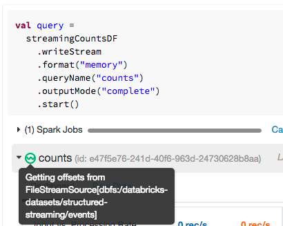
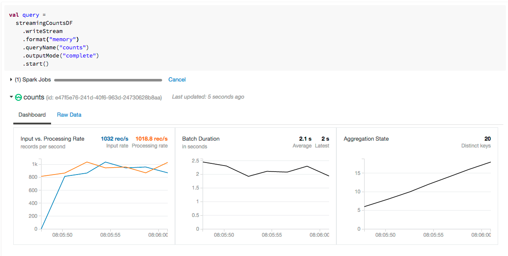
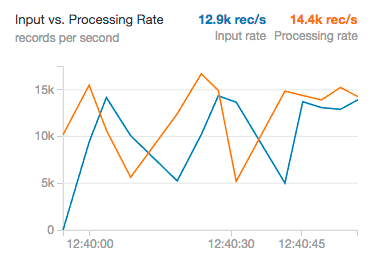
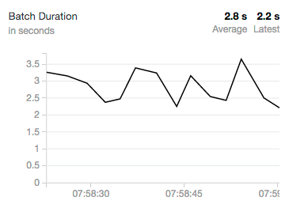
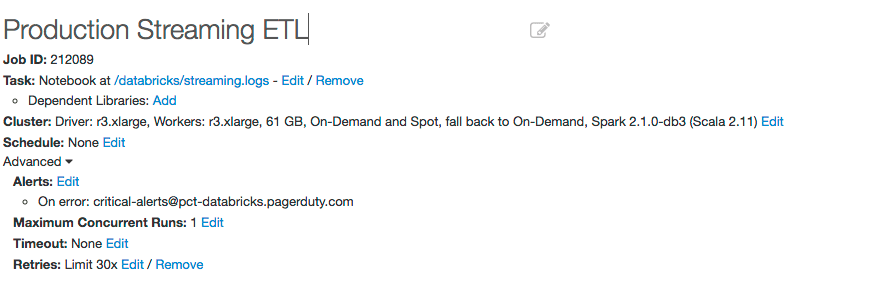

＃将Apache Spark的结构化流应用于生产

可伸缩数据@ Databricks的第5部分

在过去的几个月中，我们已将Databricks的生产管道迁移到结构化流传输，并希望共享我们的现成部署模型，以使我们的客户能够在Databricks中快速建立生产管道。

生产应用程序需要监视，警报和自动（云本地）故障恢复方法。这篇文章不仅会带您逐步了解解决这些难题的可用API，还将向您展示Databricks如何使在生产中运行结构化流变得简单。

##指标和监控

Apache Spark中的结构化流提供了一个简单的编程API，以获取有关当前正在执行的流的信息。您可以在当前活动的流上运行两个关键命令，以获取有关正在进行的查询执行的相关信息：一个用于获取查询的当前_status_的命令和一个用于获取查询的_recentProgress_的命令。

＃＃＃ 状态

您可能会问的第一个问题是，“我的流目前正在执行什么处理？”状态维护有关流的当前状态的信息，并且可以通过启动查询时返回的对象进行访问。例如，您可能有一个简单的计数流，该流提供了以下查询定义的IOT设备的计数。

```python
query = streamingCountsDF \
    .writeStream \
    .format("memory") \
    .queryName("counts") \
    .outputMode("complete") \
    .start()
```

运行query.status将返回流的当前状态。 这为我们提供了有关流中该时间点正在发生的事情的详细信息。

    {
      "message" : "Getting offsets from FileStreamSource[dbfs:/databricks-datasets/structured-streaming/events]",
      "isDataAvailable" : true,
      "isTriggerActive" : true
    }

Databricks笔记本为您提供了一种查看任何流式查询状态的简单方法。 只需将鼠标悬停在流查询中可用的绿色流图标上。 您将获得相同的信息，从而可以更加方便地快速了解流的状态。



### Recent Progress

虽然查询状态当然很重要，但是查看查询的历史进度也同样重要。 进度元数据将使我们能够回答诸如“我以什么速率处理元组？”之类的问题。 或“元组从源到达的速度有多快？”

通过运行stream.recentProgress，您可以访问更多基于时间的信息，例如处理速度和批次持续时间。 但是，一张图片值得一千个JSON斑点，因此在Databricks，我们创建了可视化文件，以便于快速分析流的最新进度。



让我们探讨为什么我们选择显示这些指标以及它们为什么对您来说很重要。

####输入速率和处理速率

输入速率指定从诸如Kafka或Kinesis之类的系统流入结构化流的数据量。 处理速度是我们能够分析数据的速度。 在理想情况下，这些参数应始终保持一致。 但是，它们将根据处理开始时存在的输入数据量而有所不同。 如果输入速率远远超过处理速率，我们的流将落在后面，我们将不得不将群集扩展到更大的大小以处理更大的负载。



####批处理持续时间

几乎所有流系统都利用批处理以任何合理的吞吐量运行（某些系统可以选择高延迟来换取较低的吞吐量）。 结构化流媒体可以同时实现。 当它对数据进行操作时，随着结构化流处理随时间变化的事件数量，您可能会看到这种振荡。 在Community Edition的这个单核群集上，我们可以看到批处理持续时间大约在三秒左右波动。 自然，较大的群集将具有更快的处理速度以及更短的批处理时间。



##流作业的生产警报

指标和监控都很好，但是为了快速应对出现的任何问题而又不必整天忙于流媒体工作，您将需要一个强大的警报故事。 Databricks允许您将Streaming作业作为生产管道运行，从而使警报变得容易。

例如，让我们使用以下规范定义Databricks作业：



请注意，我们如何设置电子邮件地址以触发PagerDuty中的警报。作业失败时，这将触发产品警报（或达到您指定的级别）。

##自动故障恢复

虽然警报很方便，但是最好迫使人们对停电做出响应是不便的，而在最坏的情况下是不可能的。为了真正实现结构化流的生产，您将希望能够在确保数据一致性且不丢失数据的情况下，尽快恢复故障。 Databricks使这一过程变得无缝：只需设置不可恢复故障之前的重试次数，Databricks就会尝试为您自动恢复流作业。在每次失败时，您都可以将通知作为生产中断触发。

您将两全其美。该系统将尝试自我修复，同时让员工和开发人员了解该状态。

##更新您的应用程序

在更新流应用程序时，需要考虑两种情况。在大多数情况下，如果您不更改重要的业务逻辑（例如输出架构），则可以使用相同的检查点目录重新启动流式作业。新的更新的流应用程序将在中断的地方继续运行。

但是，如果您要更改状态操作（例如聚合或输出架构），则更新会涉及更多的内容。您必须使用新的检查点目录开始全新的流。幸运的是，在过渡到新流时，很容易在Databricks中启动另一个流，以便同时并行运行。

##高级警报和监视

Databricks也支持其他几种高级监视技术。例如，您可以使用Datadog，Apache Kafka或Coda Hale Metrics之类的系统输出通知。这些先进技术可用于实施外部监视和警报系统。

下面是一个示例，说明如何创建StreamingQueryListener并将所有查询进度信息转发到Kafka。

```scala
class KafkaMetrics(servers: String) extends StreamingQueryListener {
  val kafkaProperties = new Properties()
  kafkaProperties.put("bootstrap.servers", servers)
  kafkaProperties.put("key.serializer", "kafkashaded.org.apache.kafka.common.serialization.StringSerializer")
  kafkaProperties.put("value.serializer", "kafkashaded.org.apache.kafka.common.serialization.StringSerializer")

  val producer = new KafkaProducer[String, String](kafkaProperties)

  def onQueryProgress(event: org.apache.spark.sql.streaming.StreamingQueryListener.QueryProgressEvent): Unit = {
    producer.send(new ProducerRecord("streaming-metrics", event.progress.json))
  }
  def onQueryStarted(event: org.apache.spark.sql.streaming.StreamingQueryListener.QueryStartedEvent): Unit = {}
  def onQueryTerminated(event: org.apache.spark.sql.streaming.StreamingQueryListener.QueryTerminatedEvent): Unit = {}
}
```

## Conclusion

在本文中，我们展示了使用Databricks将结构化流从原型制作到生产的过程非常简单。 要了解有关结构化流媒体其他方面的更多信息，请阅读我们的系列博客：

-Apache Spark中的结构化流
-Apache Spark 2.1中具有结构化流的实时流ETL
-在Apache Spark 2.1中使用结构化流处理复杂的数据格式
-在Apache Spark 2.2中使用结构化流处理Apache Kafka中的数据
-Apache Spark结构化流中的事件时间聚合和水印
