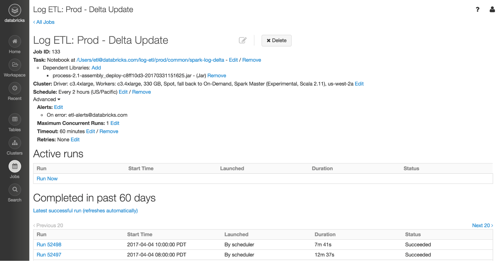

＃每天运行一次流作业，可节省10倍的成本

可伸缩数据@ Databricks的第6部分

传统上，当人们想到流媒体时，会想到诸如“实时”，“ 24/7”或“始终在线”之类的术语。您可能会遇到数据仅以固定间隔到达的情况。也就是说，数据每小时或每天一次出现。对于这些用例，对这些数据执行增量处理仍然是有益的。但是，将集群保持为24/7全天候运行并仅执行每天一次的少量处理将是浪费的。

幸运的是，通过使用添加到Spark 2.2中的结构化流中的新的“运行一次”触发器功能，您将获得Catalyst Optimizer增加工作量的所有好处，并节省了没有空闲集群的成本。在本文中，我们将研究如何使用触发器来完成这两个任务。

##结构化流中的触发器

在结构化流中，触发器用于指定流查询应多久生成一次结果。触发器触发后，Spark会检查是否有新数据可用。如果有新数据，则对自上次触发以来到达的所有内容递增执行查询。如果没有新数据，则流将休眠，直到触发下一个触发器。

结构化流的默认行为是以尽可能低的延迟运行，因此一旦前一个触发器完成，触发器便会触发。对于具有较低延迟要求的用例，结构化流支持ProcessingTime触发器，该触发器将触发每个用户提供的间隔（例如，每分钟）。

尽管这很棒，但仍要求集群保持24/7全天候运行。相反，RunOnce触发器将仅触发一次，然后将停止查询。正如我们将在下面看到的那样，这使您可以有效地利用外部调度机制，例如Databricks Jobs。

启动流时指定触发器。

```python
# Load your Streaming DataFrame
sdf = spark.readStream.load(path="/in/path", format="json", schema=my_schema)
# Perform transformations and then write…
sdf.writeStream.trigger(once=True).start(path="/out/path", format="parquet")
```

```scala
import org.apache.spark.sql.streaming.Trigger

// Load your Streaming DataFrame
val sdf = spark.readStream.format("json").schema(my_schema).load("/in/path")
// Perform transformations and then write…
sdf.writeStream.trigger(Trigger.Once).format("parquet").start("/out/path")
```

##为什么Streaming和RunOnce比批处理要好

您可能会问，这与仅运行批处理作业有何不同？让我们来看看在批处理作业中运行结构化流的好处。

###簿记

当您运行执行增量更新的批处理作业时，通常必须弄清楚什么是新数据，应该处理什么以及不应该处理什么。结构化流已经为您完成了所有这一切。在编写通用流应用程序时，您应该只关心业务逻辑，而不是低级簿记。

###表级原子性

大数据处理引擎的最重要特征是它如何容忍故障和失败。 ETL作业可能（实际上通常会）失败。如果作业失败，则需要确保清除作业的输出，否则，在下一次成功运行作业后，您将得到重复或垃圾数据。

使用结构化流写出基于文件的表时，结构化流在每次成功触发后将作业创建的所有文件提交到日志中。当Spark读回表时，它将使用此日志来确定哪些文件有效。这确保了由故障引入的垃圾不会被下游应用程序消耗。

###跨运行状态操作

如果您的数据管道可以生成重复的记录，但是您只想使用一次语义，那么如何使用批处理工作负载来实现呢？使用结构化流媒体，就像设置水印并使用`dropDuplicates（）`一样简单。通过将水印配置足够长的时间以涵盖您的流作业的多次运行，您将确保不会在整个运行中重复数据。

＃＃ 节约成本

运行24/7流媒体作业是一项代价高昂的考验。您可能会有几个小时的等待时间可以接受的用例，或者每小时或每天都有数据输入。为了获得上述结构化流传输的所有好处，您可能认为您需要一直保持集群正常运行。但是现在，有了“一次执行”触发器，您就不需要！

在Databricks，我们有两个阶段的数据流水线，包括一个可提供最新数据的增量作业，以及在一天结束时处理一整天的数据，执行重复数据删除和覆盖数据的一项作业。增量作业的输出。第二个作业将使用比第一个作业大得多的资源（4倍），并且运行时间也会更长（3倍）。我们能够摆脱许多管道中的第二项工作，节省了10倍的总成本。我们还可以使用新的一次执行触发器清除代码库中的许多代码。这些节省的成本使财务和工程经理都高兴！

##使用Databricks调度运行

Databricks的Jobs Scheduler使用户只需单击几下即可安排生产作业。 Jobs Scheduler是计划使用一次执行触发器运行的结构化流作业的理想选择。



在Databricks，我们使用Jobs调度程序来运行我们所有的生产作业。作为工程师，我们确保ETL工作中的业务逻辑经过良好测试。我们将代码作为库上传到Databricks，并设置了笔记本来设置ETL作业的配置，例如输入文件目录。其余的工作由Databricks负责管理集群，安排和执行作业，以及由结构化流技术确定哪些文件是新文件以及处理传入数据。最终结果是从数据源到数据仓库的端到端（不仅在Spark内部），而且数据通道也只有一次。查看我们的文档，了解如何最佳地运行Jobs的结构化流。

##摘要

在此博客文章中，我们介绍了结构化流的新“一次执行”触发器。尽管一次执行触发器类似于运行批处理作业，但我们讨论了它比批处理作业方法具有的所有优点，尤其是：

-管理所有簿记要处理的数据
-为ETL作业提供表级原子性到文件存储
-确保跨作业运行的有状态操作，从而允许轻松进行重复数据删除

除了批处理方面的所有这些优点之外，您还可以节省成本，而不必设置空闲的24/7集群并为不规则的流作业运行。批处理和流处理的两全其美现在就在您的指尖。

申请14天免费试用，今天就可以在Databricks中尝试结构化流式传输。

本博客系列的其他部分还介绍了其他好处：

-Apache Spark 2.1中具有结构化流的实时流ETL
-在Apache Spark 2.1中使用结构化流处理复杂的数据格式
-在Apache Spark 2.2中使用结构化流处理Apache Kafka中的数据
-Apache Spark结构化流中的事件时间聚合和水印
-将Apache Spark的结构化结构化流应用于生产
-每天运行一次流作业，可节省10倍的成本
