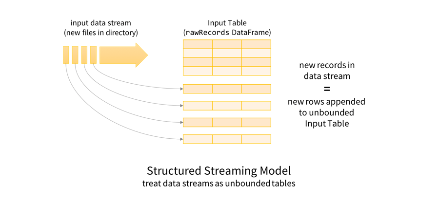
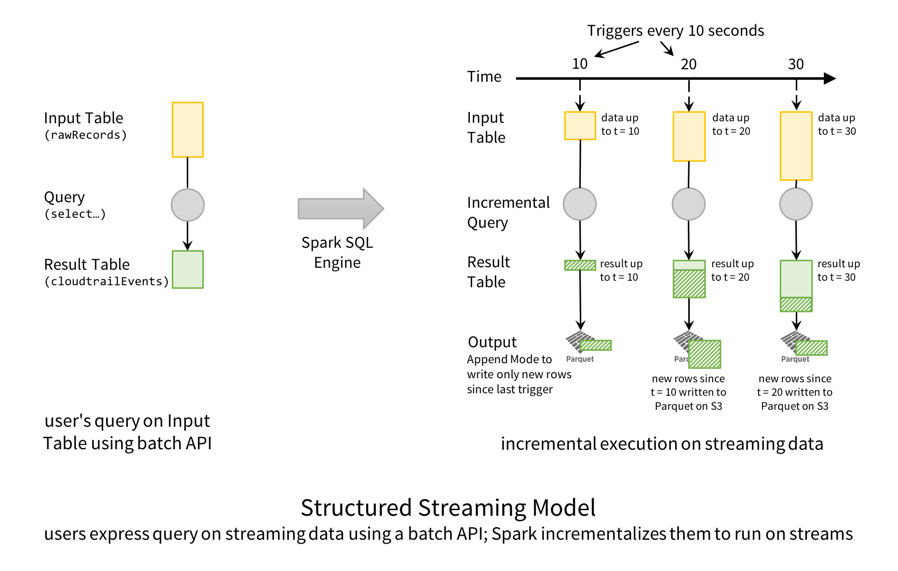
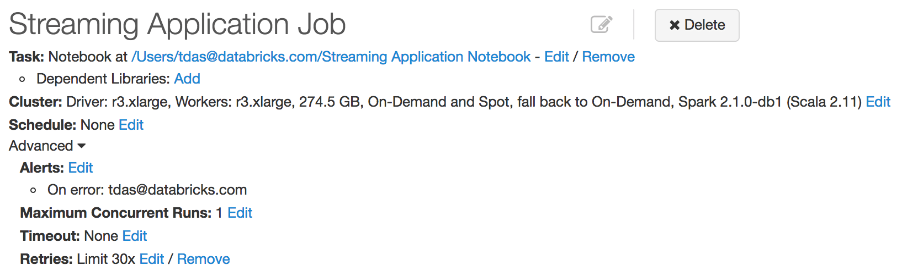

# Real-time Streaming ETL with Structured Streaming in Apache Spark 2.1

Part 1 of Scalable Data @ Databricks

by Tathagata Das, Michael Armbrust and Tyson Condie Posted in Engineering Blog January 19, 2017

We are well into the Big Data era, with organizations collecting massive amounts of data on a continual basis. Yet, the value of this data deluge hinges on the ability to extract actionable insights in a timely fashion. Hence, there is an increasing need for continuous applications that can derive real-time actionable insights from massive data ingestion pipelines.

However, building production-grade continuous applications can be challenging, as developers need to overcome many obstacles, including:

* **Providing end-to-end reliability and correctness guarantees** - Long running data processing systems must be resilient to failures by ensuring that outputs are consistent with results processed in batch. Additionally, unusual activities (e.g failures in upstream components, traffic spikes, etc.) must be continuously monitored and automatically mitigated to ensure highly available insights are delivered in real-time.
* **Performing complex transformations** - Data arrives in a myriad formats (CSV, JSON, Avro, etc.) that often must be restructured, transformed and augmented before being consumed. Such restructuring requires that all the traditional tools from batch processing systems are available, but without the added latencies that they typically entail.
* **Handling late or out-of-order data** - When dealing with the physical world, data arriving late or out-of-order is a fact of life. As a result, aggregations and other complex computations must be continuously (and accurately) revised as new information arrives.
* **Integrating with other systems** - Information originates from a variety of sources (Kafka, HDFS, S3, etc), which must be integrated to see the complete picture.

Structured Streaming in Apache Spark builds upon the strong foundation of Spark SQL, leveraging its powerful APIs to provide a seamless query interface, while simultaneously optimizing its execution engine to enable low-latency, continually updated answers. This blog post kicks off a series in which we will explore how we are using the new features of Apache Spark 2.1 to overcome the above challenges and build our own production pipelines.

In this first post, we will focus on an ETL pipeline that converts raw AWS CloudTrail audit logs into a JIT data warehouse for faster ad-hoc queries. We will show how easy it is to take an existing batch ETL job and subsequently productize it as a real-time streaming pipeline using Structured Streaming in Databricks. Using this pipeline, we have converted 3.8 million JSON files containing 7.9 billion records into a Parquet table, which allows us to do ad-hoc queries on updated-to-the-minute Parquet table 10x faster than those on raw JSON files.

## The Need for Streaming ETL

Extract, Transform, and Load (ETL) pipelines prepare raw, unstructured data into a form that can be queried easily and efficiently. Specifically, they need to be able to do the following:

* **Filter, transform, and clean up data** - Raw data is naturally messy and needs to be cleaned up to fit into a well-defined structured format. For example, parsing timestamp strings to date/time types for faster comparisons, filtering corrupted data, nesting/unnesting/flattening complex structures to better organize important columns, etc.
* **Convert to a more efficient storage format** - Text, JSON and CSV data are easy to generate and are human readable, but are very expensive to query. Converting it to more efficient formats like Parquet, Avro, or ORC can reduce file size and improve processing speed.
* **Partition data by important columns** - By partitioning the data based on the value of one or more columns, common queries can be answered more efficiently by reading only the relevant fraction of the total dataset.

Traditionally, ETL is performed as periodic batch jobs. For example, dump the raw data in real time, and then convert it to structured form every few hours to enable efficient queries. We had initially setup our system this way, but this technique incurred a high latency; we had to wait for few hours before getting any insights. For many use cases, this delay is unacceptable. When something suspicious is happening in an account, we need to be able to ask questions immediately. Waiting minutes to hours could result in an unreasonable delay in responding to an incident.

Fortunately, Structured Streaming makes it easy to convert these periodic batch jobs to a real-time data pipeline. Streaming jobs are expressed using the same APIs as batch data. Additionally, the engine provides the same fault-tolerance and data consistency guarantees as periodic batch jobs, while providing much lower end-to-end latency.

In the rest of post, we dive into the details of how we transform AWS CloudTrail audit logs into an efficient, partitioned, parquet data warehouse. AWS CloudTrail allows us to track all actions performed in a variety of AWS accounts, by delivering gzipped JSON logs files to a S3 bucket. These files enable a variety of business and mission critical intelligence, such as cost attribution and security monitoring. However, in their original form, they are very costly to query, even with the capabilities of Apache Spark. To enable rapid insight, we run a Continuous Application that transforms the raw JSON logs files into an optimized Parquet table. Let’s dive in and look at how to write this pipeline. If you want to see the full code, here are the Scala and Python notebooks. Import them into Databricks and run them yourselves.

## Transforming Raw Logs with Structured Streaming

We start by defining the schema of the JSON records based on CloudTrail documentation.

```scala
val cloudTrailSchema = new StructType()
  .add("Records", ArrayType(new StructType()
    .add("additionalEventData", StringType)
    .add("apiVersion", StringType)
    .add("awsRegion", StringType)
    // ...
```

See the attached notebook for the full schema. With this, we can define a streaming DataFrame that represents the data stream from CloudTrail files that are being written in a S3 bucket.

```scala
val rawRecords = spark.readStream
  .schema(cloudTrailSchema)
  .json("s3n://mybucket/AWSLogs/*/CloudTrail/*/2017/*/*")
```

A good way to understand what this rawRecords DataFrame represents is to first understand the Structured Streaming programming model. The key idea is to treat any data stream as an unbounded table: new records added to the stream are like rows being appended to the table.



This allows us to treat both batch and streaming data as tables. Since tables and DataFrames/Datasets are semantically synonymous, the same batch-like DataFrame/Dataset queries can be applied to both batch and streaming data. In this case, we will transform the raw JSON data such that it’s easier to query using Spark SQL’s built-in support for manipulating complex nested schemas. Here is an abridged version of the transformation.

```scala
val cloudtrailEvents = rawRecords
  .select(explode($"records") as 'record)
  .select(
    unix_timestamp(
      $"record.eventTime",
      "yyyy-MM-dd'T'hh:mm:ss").cast("timestamp") as 'timestamp, $"record.*")
```

Here, we explode (split) the array of records loaded from each file into separate records. We also parse the string event time string in each record to Spark’s timestamp type, and flatten out the nested columns for easier querying. Note that if cloudtrailEvents was a batch DataFrame on a fixed set of files, then we would have written the same query, and we would have written the results only once as parsed.write.parquet("/cloudtrail"). Instead, we will start a **StreamingQuery** that runs continuously to transform new data as it arrives.

```scala
val streamingETLQuery = cloudtrailEvents
  .withColumn("date", $"timestamp".cast("date") // derive the date
  .writeStream
  .trigger(ProcessingTime("10 seconds")) // check for files every 10s
  .format("parquet") // write as Parquet partitioned by date
  .partitionBy("date")
  .option("path", "/cloudtrail")
  .option("checkpointLocation", "/cloudtrail.checkpoint/")
  .start()
```

Here we are specifying the following configurations for the StreamingQuery before starting it.

* Derive the date from the timestamp column
* Check for new files every 10 seconds (i.e., trigger interval)
* Write the transformed data from parsed DataFrame as a Parquet-formatted table at the path `/cloudtrail`.
* Partition the Parquet table by date so that we can later efficiently query time slices of the data; a key requirement in monitoring applications.
* Save checkpoint information at the path `/checkpoints/cloudtrail` for fault-tolerance (explained later in the blog)

In terms of the Structured Streaming Model, this is how the execution of this query is performed.



Conceptually, the `rawRecords` DataFrame is an append-only **Input Table**, and the `cloudtrailEvents` DataFrame is the transformed **Result Table**. In other words, when new rows are appended to the input (`rawRecords`), the result table (`cloudtrailEvents`) will have new transformed rows. In this particular case, every 10 seconds, Spark SQL engine **triggers** a check for new files. When it finds new data (i.e., new rows in the Input Table), it transforms the data to generate new rows in the Result Table, which then get written out as Parquet files.

Furthermore, while this streaming query is running, you can use Spark SQL to simultaneously query the Parquet table. The streaming query writes the Parquet data transactionally such that concurrent interactive query processing will always see a consistent view of the latest data. This strong guarantee is known as prefix-integrity and it makes Structured Streaming pipelines integrate nicely with the larger Continuous Application.

## Solving Production Challenges

Earlier, we highlighted a number of challenges that must be solved for running a streaming ETL pipeline in production. Let’s see how Structured Streaming running on the Databricks platform solves them.

### Recovering from Failures to get Exactly-once Fault-tolerance Guarantees

Long running pipelines must be able to tolerate machine failures. With Structured Streaming, achieving fault-tolerance is as easy as specifying a checkpoint location for the query. In the earlier code snippet, we did so in the following line.

```scala
.option("checkpointLocation", "/cloudtrail.checkpoint/")
```

This checkpoint directory is per query, and while a query is active, Spark continuously writes metadata of the processed data to the checkpoint directory. Even if the entire cluster fails, the query can be restarted on a new cluster, using the same checkpoint directory, and consistently recover. More specifically, on the new cluster, Spark uses the metadata to start the new query where the failed one left off, thus ensuring end-to-end exactly-once guarantees and data consistency (see Fault Recovery section of our previous blog).

Furthermore, this same mechanism allows you to upgrade your query between restarts, as long as the input sources and output schema remain the same. Since Spark 2.1, we encode the checkpoint data in JSON for future-proof compatibility. So you can restart your query even after updating your Spark version. In all cases, you will get the same fault-tolerance and consistency guarantees.

Note that **Databricks makes it very easy to set up automatic recovery**, as we will show in the next section.

### Monitoring, Alerting and Upgrading

For a Continuous Application to run smoothly, it must be robust to individual machine or even whole cluster failures. In Databricks, we have developed tight integration with Structured Streaming that allows us continuously monitor your StreamingQueries for failures (and automatically restart them. All you have to do is create a new Job, and configure the Job retry policy. You can also configure the job to send emails to notify you of failures.



Application upgrades can be easily made by updating your code and/or Spark version and then restarting the Job. See our guide on running Structured Streaming in Production for more details.

Machine failures are not the only situations that we need to handle to ensure robust processing. We will discuss how to monitor for traffic spikes and upstream failures in more detail later in this series.

### Combining Live Data with Historical/Batch Data

Many applications require historical/batch data to be combined with live data. For example, besides the incoming audit logs, we may already have a large backlog of logs waiting to be converted. Ideally, we would like to achieve both, interactively query the latest data as soon as possible, and also have access to historical data for future analysis. It is often complex to set up such a pipeline using most existing systems as you would have to set up multiples processes: a batch job to convert the historical data, a streaming pipeline to convert the live data, and maybe a another step to combine the results.

Structured Streaming eliminates this challenge. You can configure the above query to prioritize the processing new data files as they arrive, while using the space cluster capacity to process the old files. First, we set the option `latestFirst` for the file source to true, so that new files are processed first. Then, we set the `maxFilesPerTrigger` to limit how many files to process every time. This tunes the query to update the downstream data warehouse more frequently, so that the latest data is made available for querying as soon as possible. Together, we can define the rawLogs DataFrame as follows:

```scala
val rawJson = spark.readStream
  .schema(cloudTrailSchema)
  .option("latestFirst", "true")
  .option("maxFilesPerTrigger", "20")
  .json("s3n://mybucket/AWSLogs/*/CloudTrail/*/2017/01/*")
```

In this way, we can write a single query that easily combines live data with historical data, while ensuring low-latency, efficiency and data consistency.

## Conclusion

Structured Streaming in Apache Spark is the best framework for writing your streaming ETL pipelines, and Databricks makes it easy to run them in production at scale, as we demonstrated above. We shared a high level overview of the steps—extracting, transforming, loading and finally querying—to set up your streaming ETL production pipeline. We also discussed and demonstrated how Structured Streaming overcomes the challenges in solving and setting up high-volume and low-latency streaming pipelines in production.