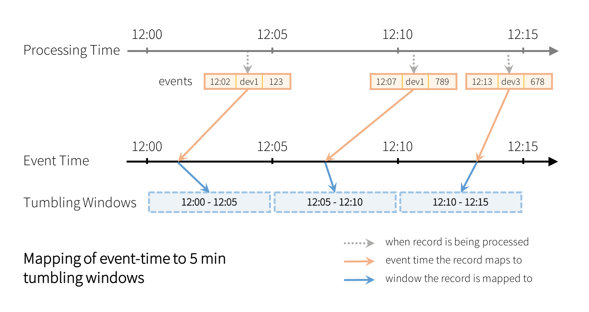
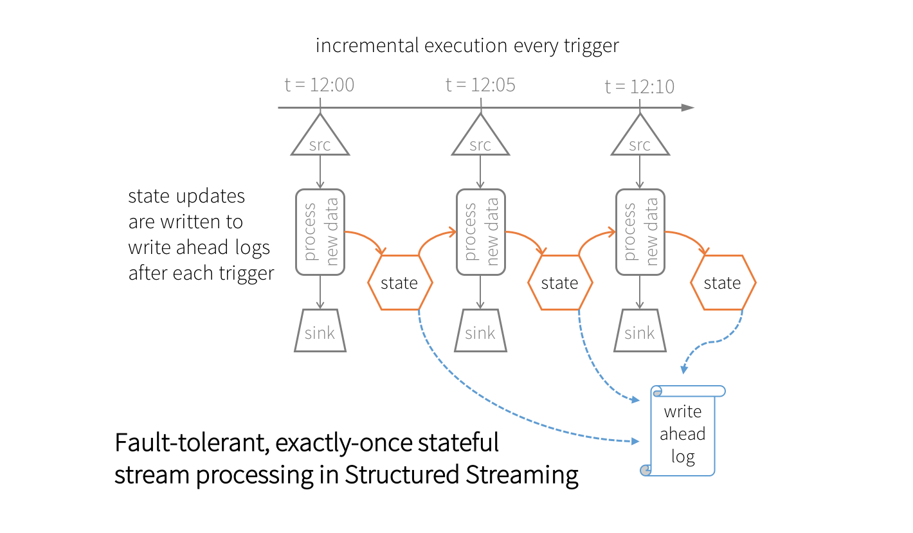
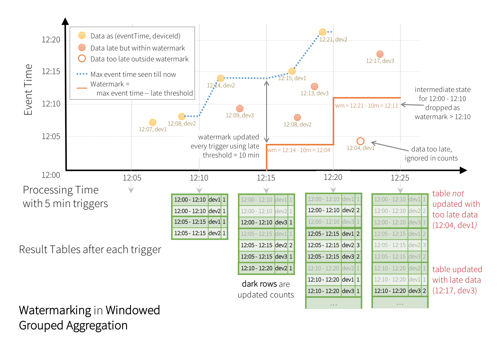

# Event-time Aggregation and Watermarking in Apache Spark’s Structured Streaming

Part 4 of Scalable Data @ Databricks

Continuous applications often require near real-time decisions on real-time aggregated statistics -- such as health of and readings from IoT devices or detecting anomalous behavior. In this blog, we will explore how easily streaming aggregations can be expressed in Structured Streaming, and how naturally late, and out-of-order data is handled.

## Streaming Aggregations

Structured Streaming allows users to express the same streaming query as a batch query, and the Spark SQL engine incrementalizes the query and executes on streaming data. For example, suppose you have a streaming DataFrame having events with signal strength from IoT devices, and you want to calculate the running average signal strength for each device, then you would write the following Python code:

```python
# DataFrame w/ schema [eventTime: timestamp, deviceId: string, signal: bigint]
eventsDF = ...

avgSignalDF = eventsDF.groupBy("deviceId").avg("signal")
```

This code is no different if eventsDF was a DataFrame on static data. However, in this case, the average will be continuously updated as new events arrive. You choose different output modes for writing the updated averages to external systems like file systems and databases. Furthermore, you can also implement custom aggregations using Spark’s user-defined aggregation function (UDAFs).

## Aggregations on Windows over Event-Time

In many cases, rather than running aggregations over the whole stream, you want aggregations over data bucketed by time windows (say, every 5 minutes or every hour). In our earlier example, it’s insightful to see what is the average signal strength in last 5 minutes in case if the devices have started to behave anomalously. Also, this 5 minute window should be based on the timestamp embedded in the data (aka. event-time) and not on the time it is being processed (aka. processing-time).

Earlier Spark Streaming DStream APIs made it hard to express such event-time windows as the API was designed solely for processing-time windows (that is, windows on the time the data arrived in Spark). In Structured Streaming, expressing such windows on event-time is simply performing a special grouping using the `window()` function. For example, counts over 5 minute tumbling (non-overlapping) windows on the eventTime column in the event is as following.

```python
from pyspark.sql.functions import *

windowedAvgSignalDF = \
  eventsDF \
    .groupBy(window("eventTime", "5 minute")) \
    .count()
```

In the above query, every record is going to be assigned to a 5 minute tumbling window as illustrated below.



Each window is a group for which running counts are calculated. You can also define overlapping windows by specifying both the window length and the sliding interval. For example:

```python
from pyspark.sql.functions import *

windowedAvgSignalDF = \
  eventsDF \
    .groupBy(window("eventTime", "10 minutes", "5 minutes")) \
    .count()
```

In the above query, every record will be assigned to multiple overlapping windows as illustrated below.


This grouping strategy automatically handles late and out-of-order data -- the late event would just update older window groups instead of the latest ones. Here is an end-to-end illustration of a query that is grouped by both the `deviceId` and the overlapping windows. The illustration below shows how the final result of a query changes after new data is processed with 5 minute triggers when you are grouping by both `deviceId` and sliding windows (for brevity, the "signal" field is omitted).

```python
windowedCountsDF = \
  eventsDF \
    .groupBy(
      "deviceId",
      window("eventTime", "10 minutes", "5 minutes")) \
    .count()
```


Note how the late, out-of-order record [12:04, dev2] updated an old window’s count.

## Stateful Incremental Execution

While executing any streaming aggregation query, the Spark SQL engine internally maintains the intermediate aggregations as fault-tolerant state. This state is structured as key-value pairs, where the key is the group, and the value is the intermediate aggregation. These pairs are stored in an in-memory, versioned, key-value "state store" in the Spark executors that is checkpointed using write ahead logs in an HDFS-compatible file system (in the configured checkpoint location). At every trigger, the state is read and updated in the state store, and all updates are saved to the write ahead log. In case of any failure, the correct version of the state is restored from checkpoint information, and the query proceeds from the point it failed. Together with replayable sources, and idempotent sinks, Structured Streaming ensures exactly-once guarantees for stateful stream processing.



This fault-tolerant state management naturally incurs some processing overheads. To keep these overheads bounded within acceptable limits, the size of the state data should not grow indefinitely. However, with sliding windows, the number of windows/groups will grow indefinitely, and so can the size of state (proportional to the number of groups). To bound the state size, we have to be able to drop old aggregates that are not going to be updated any more, for example seven day old averages. We achieve this using **watermarking**.

## Watermarking to Limit State while Handling Late Data

As mentioned before, the arrival of late data can result in updates to older windows. This complicates the process of defining which old aggregates are not going to be updated and therefore can be dropped from the state store to limit the state size. In Apache Spark 2.1, we have introduced **watermarking** that enables automatic dropping of old state data.

Watermark is a moving threshold in event-time that trails behind the maximum event-time seen by the query in the processed data. The trailing gap defines how long we will wait for late data to arrive. By knowing the point at which no more data will arrive for a given group, we can limit the total amount of state that we need to maintain for a query. For example, suppose the configured maximum lateness is 10 minutes. That means the events that are up to 10 minutes late will be allowed to aggregate. And if the maximum observed event time is 12:33, then all the future events with event-time older than 12:23 will be considered as "too late" and dropped. Additionally, all the state for windows older than 12:23 will be cleared. You can set this parameter based on the requirements of your application — larger values of this parameter allows data to arrive later but at the cost of increased state size, that is, memory usage and vice versa.

Here is the earlier example but with watermarking.

```python
windowedCountsDF = \
  eventsDF \
    .withWatermark("eventTime", "10 minutes") \
    .groupBy(
      "deviceId",
      window("eventTime", "10 minutes", "5 minutes")) \
    .count()
```

When this query is executed, Spark SQL will automatically keep track of the maximum observed value of the eventTime column, update the watermark and clear old state. This is illustrated below.



Note the two events that arrive between the processing-times 12:20 and 12:25. The watermark is used to differentiate between the late and the "too-late" events and treat them accordingly.

## Conclusion

In short, I covered Structured Streaming’s windowing strategy to handle key streaming aggregations: windows over event-time and late and out-of-order data. Using this windowing strategy allows Structured Streaming engine to implement watermarking, in which late data can be discarded. As a result of this design, we can manage the size of the state-store.

In the upcoming version of Apache Spark 2.2, we have added more advanced stateful stream processing operations to streaming DataFrames/Datasets. Stay tuned to this blog series for more information. If you want to learn more about Structured Streaming, read our previous posts in the series.

- Structured Streaming In Apache Spark
- Real-time Streaming ETL with Structured Streaming in Apache Spark 2.1
- Working with Complex Data Formats with Structured Streaming in Apache Spark 2.1
- Processing Data in Apache Kafka with Structured Streaming in Apache Spark 2.2
