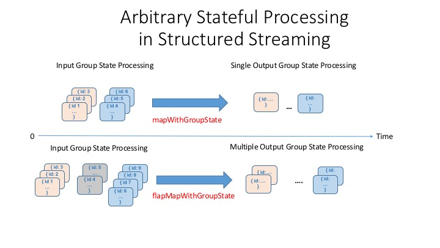

＃Apache Spark的结构化流中的任意状态处理

可伸缩数据@ Databricks的第7部分

＃＃ 介绍

大多数数据流尽管是连续的，但在流中具有离散事件，每个事件在发生事件时都带有时间戳记。因此，“事件时间”的概念对于如何为事件时间处理构建结构化流API以及它们提供的处理这些离散事件的功能至关重要。

结构化流文档和我们关于结构流的技术资产选集充分介绍了事件时间基础和事件时间处理。为简便起见，我们在这里不介绍它们。建立在事件时间处理（例如滑动窗口，翻滚窗口和水印）开发（并经过大规模测试）的概念上，此博客将重点关注两个主题：

1.如何处理事件流中的重复项
2.如何处理任意或自定义状态处理

##删除重复项

没有流事件没有重复的条目。必须在一次记录系统中删除重复的条目-出于多种原因，这通常是繁琐的操作。首先，您必须一次处理小批或大批记录，以将其丢弃。其次，由于网络的高延迟，某些事件可能会无序或延迟到达，这可能迫使您重申或重复该过程。您如何解释呢？

结构化流确保精确的一次语义，可以根据任意密钥丢弃重复的消息。为了消除重复数据，Spark将维护许多用户指定的密钥，并确保在遇到重复数据时将其丢弃。

就像结构化流中的其他有状态处理API受声明用于后期数据语义的水印限制一样，删除重复项也是如此。如果不加水印，则保持状态可以在流的过程中无限增长。

指示结构化流删除重复项的API与到目前为止我们在博客和文档中显示的所有其他API一样简单。使用API​​，您可以任意声明要删除重复项的列-例如，“ user_id”和“ timestamp”。具有相同“时间戳”和“ user_id”的条目被标记为重复并被删除，但是具有两个不同时间戳的相同条目则未被标记为重复。
让我们看一个示例，说明如何使用简单的API删除重复项。

```scala
import org.apache.spark.sql.functions.expr

withEventTime
  .withWatermark("event_time", "5 seconds")
  .dropDuplicates("User", "event_time")
  .groupBy("User")
  .count()
  .writeStream
  .queryName("deduplicated")
  .format("memory")
  .outputMode("complete")
  .start()
```

```python
from pyspark.sql.functions import expr

withEventTime\
  .withWatermark("event_time", "5 seconds")\
  .dropDuplicates(["User", "event_time"])\
  .groupBy("User")\
  .count()\
  .writeStream\
  .queryName("pydeduplicated")\
  .format("memory")\
  .outputMode("complete")\
  .start()
```

在查询过程中，如果要发出SQL查询，则会得到准确的结果，所有重复项都将删除。

```sql
SELECT * FROM deduplicated
+----+-----+
|User|count|
+----+-----+
|   a| 8085|
|   b| 9123|
|   c| 7715|
|   g| 9167|
|   h| 7733|
|   e| 9891|
|   f| 9206|
|   d| 8124|
|   i| 9255|
+----+-----+
```

接下来，我们将扩展如何使用两个结构化流API实现自定义状态处理。

##使用任意或自定义有状态处理

并非所有基于事件时间的处理都等于或像聚合事件中的特定数据列一样简单。其他事件则更为复杂。它们需要按归因于一组的事件行进行处理；并且仅在通过发出单个结果或多行结果来进行整体处理时才有意义，具体取决于您的用例。

考虑以下用例，其中必须进行任意或自定义的状态处理：

1.如果我们观察到事件随时间推移超过阈值，则希望基于事件组或事件类型发出警报
2.我们希望在确定或不确定的时间内维护用户会话，并保留这些会话以进行后期分析。

以上所有情况都需要定制处理。结构化流API提供了一组API来处理这些情况：“ mapGroupsWithState”和“ flatMapGroupsWithState”。 “ mapGroupsWithState”可以对组进行操作，并且每个组只能输出一个结果行，而“ flatMapGroupsWithState”可以为每个组发出一个结果行或多个结果行。



###超时和状态

需要注意的一件事是，因为我们根据用户定义的概念来管理组的状态（如上针对用例所述），所以水印的语义（过期或丢弃事件）可能并不总是在这里适用。相反，我们必须自己指定一个适当的超时。超时决定了在超时某些中间状态之前我们应该等待多长时间。

超时可以基于处理时间（GroupStateTimeout.ProcessingTimeTimeout）或事件时间（GroupStateTimeout.EventTimeTimeout）。使用超时时，您可以在检查值之前先检查超时，方法是检查`state.hasTimedOut`标志。

要设置处理超时，请使用`GroupState.setTimeoutDuration（...）`方法。这意味着超时保证将在以下情况下发生：

-在方法中指定的时钟提前** X ms **之前永远不会发生超时
-** X ms **之后，当查询中有触发器时，最终将发生超时

要设置事件超时，请使用GroupState.setTimeoutTimestamp（...）。仅对于基于事件时间的超时，才必须指定水印。因此，该组中所有早于水印的事件都将被过滤掉，并且当水印超过设置的时间戳时将发生超时。

发生超时时，流查询中提供的函数将使用以下参数调用：保持状态的键；输入的迭代器行和旧状态。下面带有mapGroupsWithState的示例定义了许多使用的功能类和对象。

###示例与mapGroupsWithState

让我们举一个简单的例子，我们要找出用户何时（时间戳）在流中的给定数据集中执行其第一个和最后一个活动。在这种情况下，我们将在用户键和活动键组合上分组（或映射）。

但是首先，mapGroupsWithState需要许多功能类和对象：

1.三种类定义：输入定义，状态定义和可选的输出定义。
2.基于键，事件的迭代器和先前状态的更新功能。
3.如上所述的超时参数。

因此，让我们定义我们的输入，输出和状态数据结构定义。

```scala
case class InputRow(user:String, timestamp:java.sql.Timestamp, activity:String)
case class UserState(user:String,
  var activity:String,
  var start:java.sql.Timestamp,
  var end:java.sql.Timestamp)
```

根据给定的输入行，我们定义更新功能

```scala
def updateUserStateWithEvent(state:UserState, input:InputRow):UserState = {
// no timestamp, just ignore it
if (Option(input.timestamp).isEmpty) {
    return state
  }
//does the activity match for the input row
if (state.activity == input.activity) {
    if (input.timestamp.after(state.end)) {
      state.end = input.timestamp
    }
    if (input.timestamp.before(state.start)) {
      state.start = input.timestamp
    }
  } else {
   //some other activity
    if (input.timestamp.after(state.end)) {
      state.start = input.timestamp
      state.end = input.timestamp
      state.activity = input.activity
    }
  }
  //return the updated state
  state
}
```

最后，我们编写函数来定义根据行的纪元更新状态的方式。

```scala
import org.apache.spark.sql.streaming.{GroupStateTimeout, OutputMode, GroupState}

def updateAcrossEvents(user:String,
    inputs: Iterator[InputRow],
     oldState: GroupState[UserState]):UserState = {
     var state:UserState = if (oldState.exists) oldState.get else UserState(user,
        "",
        new java.sql.Timestamp(6284160000000L),
        new java.sql.Timestamp(6284160L)
    )
  // we simply specify an old date that we can compare against and
  // immediately update based on the values in our data

  for (input <- inputs) {
    state = updateUserStateWithEvent(state, input)
    oldState.update(state)
  }
  state
}
```

放置好这些片段后，我们现在可以在查询中使用它们了。 如上所述，我们必须指定超时时间，以便该方法可以使给定组的状态超时，并且可以控制在超时后未收到任何更新的情况下应使用该状态执行的操作。 对于此说明，我们将无限期地保持状态。

```scala
import org.apache.spark.sql.streaming.GroupStateTimeout

withEventTime
  .selectExpr("User as user", "cast(Creation_Time/1000000000 as timestamp) as timestamp", "gt as activity")
  .as[InputRow]
  // group the state by user key
  .groupByKey(_.user)
  .mapGroupsWithState(GroupStateTimeout.NoTimeout)(updateAcrossEvents)
  .writeStream
  .queryName("events_per_window")
  .format("memory")
  .outputMode("update")
  .start()
```

现在，我们可以在流中查询结果：

```sql
SELECT * FROM events_per_window order by user, start
```

我们的示例结果显示了第一个和最后一个时间戳记的用户活动：

```
+----+--------+--------------------+--------------------+
|user|activity|               start|                 end|
+----+--------+--------------------+--------------------+
|   a|    bike|2015-02-23 13:30:...|2015-02-23 14:06:...|
|   a|    bike|2015-02-23 13:30:...|2015-02-23 14:06:...|
...
|   b|    bike|2015-02-24 14:01:...|2015-02-24 14:38:...|
|   b|    bike|2015-02-24 14:01:...|2015-02-24 14:38:...|
|   c|    bike|2015-02-23 12:40:...|2015-02-23 13:15:...|
...
|   d|    bike|2015-02-24 13:07:...|2015-02-24 13:42:...|
+----+--------+--------------------+--------------------+
```

＃＃ 下一步是什么

在此博客中，我们扩展了用于高级流分析的两个附加功能和API。第一个允许删除以水印为边界的重复项。使用第二种方法，您可以实现自定义的状态聚合，而不仅仅是事件时间基础知识和事件时间处理。

通过使用mapGroupsWithState API的示例，我们演示了如何为事件的实现实现自定义的有状态聚合，这些事件的处理语义不仅可以通过超时来定义，还可以通过用户语义和业务逻辑来定义。

我们将在本系列的下一个博客中探讨“ flatMapGroupsWithState”用例的高级方面，这将在都柏林的Spark Summit上的[关于结构化流的深入探讨]中进行讨论（https://databricks.com /blog/2017/09/01/streaming-etl-scale-apache-sparks-structured-streaming.html）。

＃＃ 阅读更多

自Apache Spark 2.0以来，在结构化流开发和发行过程中，我们已经汇编了全面的技术资产纲要，包括结构化系列博客。您可以在此处阅读相关资产：

-Apache Spark的结构化流技术资产选集

在Databricks的Unified Analytics Platform上尝试Apache Spark的Structured Streaming最新API。
